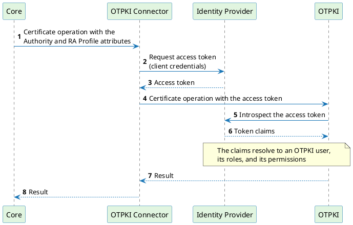

# Overview

This document outlines the steps necessary to integrate the platform with OTPKI, so that certificates can be issued, renewed, revoked, and registered in OTPKI through the platform.

[OTPKI](https://docs.otpki.com/) (OmniTrust PKI) is a cloud-native PKI service for operating certification authorities and managing the certificate lifecycle through an API-first interface.

## OTPKI Connector

The **OTPKI Connector** is the [`Connector`](../../concept-design/architecture/connector.md) that the platform uses to talk to OTPKI. It implements the [Authority Provider v3](../../connectors/provider-interfaces/authority-provider-v3.md) interface and supports the following operations:

| Operation                | Description                                                                             |
|--------------------------|-----------------------------------------------------------------------------------------|
| Issue                    | Creates an end entity in OTPKI, enrolls it, and returns the issued certificate           |
| Renew                    | Enrolls a new certificate request for an end entity that already exists in OTPKI         |
| Revoke                   | Revokes an issued certificate with the selected revocation reason                        |
| Register                 | Pre-registers an identity in OTPKI before a certificate request exists                   |
| Identify                 | Matches an existing certificate against OTPKI by its serial number                       |
| CA certificates and CRLs | Downloads the certificate chain and the latest CRL of the selected certification authority |

The connector authenticates to OTPKI with an OAuth 2.0 access token obtained through the **client credentials** grant. OTPKI validates that token against the identity provider that issued it, and resolves it to an OTPKI user whose roles determine what the connector is allowed to do.

## Prerequisites

Before you start, make sure that:

- OTPKI is installed, running, and reachable from the OTPKI Connector. Installing and operating OTPKI is out of scope of this document, refer to the [OTPKI documentation](https://docs.otpki.com/).
- An OIDC identity provider is registered in OTPKI and can issue client credentials tokens. See [Identity Providers](https://docs.otpki.com/docs/operations/administration/identity/identity-providers/).
- The OTPKI Connector is deployed and registered in the platform. Deploying the connector is out of scope of this document, see [Register Connectors](../../quick-start/certificate-management/register-connectors.mdx) for registering it.
- A [`Vault Profile`](../../concept-design/core-components/vault-profile.md) is available in the platform to store the OAuth client credentials.

## Integration

### Configuration in OTPKI

The following steps are required in OTPKI before the integration can be configured in the platform:

| #     | Reference                                                | Short description                                                             |
|-------|----------------------------------------------------------|---------------------------------------------------------------------------------|
| **1** | [Create Role and Permissions](./create-role.md)          | Create the role for the connector and grant it the permissions it needs        |
| **2** | [Create OAuth Client](./create-oauth-client.md)          | Create the OAuth client the connector authenticates with                       |
| **3** | [Configure CA and Profiles](./configure-profiles.md)     | Prepare the certification authority and the profiles used for issuance         |

### Configuration in the platform

The following steps are required in the platform to connect the prepared OTPKI:

| #     | Reference                                          | Short description                                                     |
|-------|----------------------------------------------------|-------------------------------------------------------------------------|
| **4** | [Create Authority](./create-authority.md)          | Store the OAuth client credentials and connect OTPKI as an `Authority` |
| **5** | [Create RA Profile](./create-ra-profile.md)        | Select the OTPKI profiles and configure how end entities are named     |

When both sides are configured, [Test Integration](./test-integration.md) confirms that the certificate lifecycle works end to end. [Troubleshooting](./troubleshooting.md) lists the problems most commonly seen during the setup.
