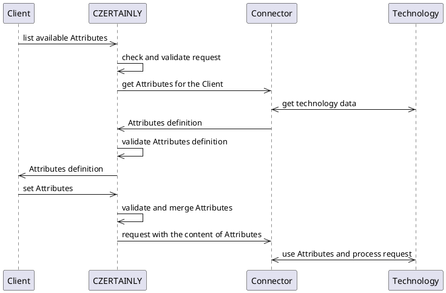

import DocCardList from '@theme/DocCardList';

# Overview

Although the CZERTAINLY platform is technology independent, each technology have its own specifics that the users should be able to use properly.

CZERTAINLY uses `Attribute` to control such specific behaviour of different technologies, like certification authorities, credential providers, discovery of certificates, etc. So called `Attributes` are used in almost every `Connector` and developer must understand them in order to implement custom behaviour or extend the functionality of the platform.

:::info
For more information about the concept behind the `Connector`, `Attributes`, `Callbacks`, etc, see the [CZERTAINLY platform overview](../../certificate-key/concept-design/overview).
:::

Now let's take a look on what exactly is an `Attribute` and how it can be used.

## It is all about the `Attributes`

The concept works on the principle of exchanging and validation of `Attributes` between the `Client`, `Connector` and CZERTAINLY platform.
Implementation of some specific `Connector` must be able to define and properly handle its specific `Attributes`. The definition is then exchanged with the `Client` and the platform validates it consistency and mediate the flow and logic between them:



Because the communication is controlled by the platform, it ensures the consistency and security of the `Attributes` that are exchanged between the `Client` and the `Connector`. and eventually applied in the target technology.

## `BaseAttribute`

The `BaseAttribute` is the base class for all `Attributes`. It contains the basic properties that are common for all `Attributes` and uses the generic type `T` to define the 'content`. Tab                                                                                                  |

You can find specification of the `BaseAttribute` in the [CZERTAINLY Interfaces repository](https://github.com/3KeyCompany/CZERTAINLY-Interfaces).

Table below describes the properties of the `BaseAttribute`:

| Property      | Type                                            | Short description                                                                                                                                   | Required                                      |
|---------------|-------------------------------------------------|-----------------------------------------------------------------------------------------------------------------------------------------------------|-----------------------------------------------|
| `uuid`        | `string`                                        | UUID of the defined `Attribute`. The combination of the `Connector` UUID and the `Attribute` UUID must be unique                                    | <span class="badge badge--success">Yes</span> |
| `name`        | `string`                                        | Name of the `Attribute`                                                                                                                             | <span class="badge badge--success">Yes</span> |
| `description` | `string`                                        | Description of the `Attribute` for better understanding of the `Attribute` purpose. This should contain descriptive explanation of the `Attribtue`. | <span class="badge badge--danger">No</span>   |
| `type`        | [`AttributeType`](./attributes#attribute-types) | Type of the `Attribute`                                                                                                                             | <span class="badge badge--success">Yes</span> |
| `content`     | [`AttributeContent`](./content)                 | Content of the `Attribute` based on the [`AttributeContentType`](./content#supported-content-types)                                                 | <span class="badge badge--danger">No</span>   |

## `Attribute` building blocks:

Each implementation of `Attribute` type consists of the following building blocks:

- `AttributeProperties` - properties defines the behaviour of the `Attribute`
- `AttributeContent` - specific content of the `Attribute` that is defined based on the `content` type
- `AttributeConstraint` - constraint that defines the validation of the `Attribute` content
- `AttributeCallback` - callback that is used to get the `Attribute` content when it depends on other factors

```plantuml
package Attribute {
    object AttributeProperties
    object AttributeContent
    object AttributeConstraint
    object AttributeCallback
}
```

The building blocks for each particular `Attribute` type are described in [Attributes](./attributes) section.

## Building blocks description and examples

The following section describes in detail each building block of the `Attribute` and provides examples of the `Attributes`.

<DocCardList/>