import Tabs from '@theme/Tabs';
import TabItem from '@theme/TabItem';

# Callbacks

In some cases, the content of the `Attribute` depends on the content of some other `Attribute` or some other aspects. This is where we use `AttributeCallback` to define the callback that will be used to get the content of the `Attribute`. The callback will be triggered when the mapping rules of the callback definition will be satisfied.

Using this approach, `Connector` can use helper controllers and APIs to achieve loading of the data from the technology and communication with the technology without the need to define the `Attribute` content, and therefore be more flexible and dynamic.

:::info[Attribute callbacks]
For more information about `Attribute` and `attributeCallback` property, see [Attributes](attributes.mdx).
:::

## Callback properties

The [`AttributeCallback`](https://github.com/CZERTAINLY/CZERTAINLY-Interfaces/blob/master/src/main/java/com/czertainly/api/model/common/attribute/v2/callback/AttributeCallback.java) contains the following properties:

| Property          | Type                                                                                                                                                                                                   | Short description                                                                                                                               | Required                                      |
|-------------------|--------------------------------------------------------------------------------------------------------------------------------------------------------------------------------------------------------|-------------------------------------------------------------------------------------------------------------------------------------------------|-----------------------------------------------|
| `callbackContext` | `string`                                                                                                                                                                                               | Context part of callback URL that should be used.                                                                                               | <span class="badge badge--success">Yes</span> |
| `callbackMethod`  | `string`                                                                                                                                                                                               | HTTP method of the callback URL that should be used.                                                                                            | <span class="badge badge--success">Yes</span> |
| `mappings`        | set of [`AttributeCallbackMapping`](https://github.com/CZERTAINLY/CZERTAINLY-Interfaces/blob/master/src/main/java/com/czertainly/api/model/common/attribute/v2/callback/AttributeCallbackMapping.java) | Mappings for the callback method, which defines how to use the data in context of the request path variables, query parameter, or body payload. | <span class="badge badge--success">Yes</span> |

The complex structure, such as objects, arrays, etc., can be mapped only into the body payload of the callback. If the complex structure will be mapped as path variable or query parameter, only its `value` content property will be used.

The following is the sample `AttributeCallback` structure:

```json
{
  "callbackContext": "/v1/authorityProvider/{authorityUuid}/certificateTemplate",
  "callbackMethod": "GET",
  "mappings": [
    {
      "from": "authority.uuid", <-- this is the value of the Attribute 'authority' and its property 'uuid'
      "to": "authorityUuid",    <-- we want to put the value 'from' to the 'authorityUuid' as the path variable
      "targets": [
        "pathVariable"          <-- the name of the path variable should match the 'to' property
      ]
    }
  ]
}
```

:::info
Mappings have various options how to include the data from other `Attributes` and request additional action based on them. See the available options in [AttributeCallbackMapping](https://github.com/CZERTAINLY/CZERTAINLY-Interfaces/blob/master/src/main/java/com/czertainly/api/model/common/attribute/v2/callback/AttributeCallbackMapping.java).
:::

## Special purpose callbacks

CZERTAINLY defines special purpose callbacks that are used for specific treatment of the `Attribute` content.

A typical example is the `DataAttribute` with the content type `CREDENTIAL`. Working with the credentials, a typical use case is to push the credentials to the `Connector` that should be authenticated and authorized based on selected credential to specific technology. However, we do not want to reveal the secret and sensitive value of the credential to the `Client`.

For that purpose we have a special callback interface that will give the `Client` credentials with the specific kind, however not the content. The content is protected by the platform.

## Supported special purpose callbacks

<table>

<tr>
<th>Callback</th>
<th>Description</th>
</tr>

<tr>
<td>

`coreGetCredentials`

</td>
<td>

```json
{
  "callbackContext": "core/getCredentials",
  "callbackMethod": "GET",
  "mappings": [
    {
      "to": "credentialKind",
      "targets": [
        "pathVariable"
      ],
      "value": "Basic"
    }
  ]
}
```
This callback allows to get the list of `Credentials` protecting its sensitive data. The list will contain only UUID and name of the `Credentials` that have the required `kind`.

</td>
</tr>

</table>

## Callbacks construction samples

### Mapping of the JSON object to the `AttributeCallback`

```mdx-code-block
<Tabs>
<TabItem value="java" label="Java">
```

```java
// definition of the AttributeCallback
AttributeCallback listValuesForAttributeTwoCallback = new AttributeCallback();
listValuesForAttributeTwoCallback.setCallbackContext("/v1/support/values");
listValuesForAttributeTwoCallback.setCallbackMethod("POST");
// map the selected object from attributeOne to callback and put it into body payload into the field with name selectedObject
Set<AttributeCallbackMapping> mappings = new HashSet<>();
mappings.add(new AttributeCallbackMapping(
        "attributeOne",
        "selectedObject"
        AttributeValueTarget.BODY));
listValuesForAttributeTwoCallback.setMappings(mappings);
attributeTwo.setAttributeCallback(listCredentialCallback);
```

```mdx-code-block
</TabItem>
</Tabs>
```

### Mapping of the JSON object field into the `AttributeCallback` path variables

```mdx-code-block
<Tabs>
<TabItem value="java" label="Java">
```

```java
// definition of the AttributeCallback
AttributeCallback listValuesForAttributeTwoCallback = new AttributeCallback();
listValuesForAttributeTwoCallback.setCallbackContext("/v1/support/{authorityId}/{customField}");
listValuesForAttributeTwoCallback.setCallbackMethod("GET");
// map the selected object value from attributeOne to callback and put it into path variable with name authorityId
// when the name of the Attribute only is specified, the value of the content is taken
Set<AttributeCallbackMapping> mappings = new HashSet<>();
mappings.add(new AttributeCallbackMapping(
        "attributeOne",
        "authorityId"
        AttributeValueTarget.PATH_VARIABLE));
        
// map the field custom from the selected object to callback and put it into path variable variable with name customField
mappings.add(new AttributeCallbackMapping(
        "attributeOne.data.custom",
        "customField"
        AttributeValueTarget.PATH_VARIABLE));
listValuesForAttributeTwoCallback.setMappings(mappings);
attributeTwo.setAttributeCallback(listCredentialCallback);
```

```mdx-code-block
</TabItem>
</Tabs>
```

## Callbacks model

The following diagram represents the callbacks model. Details can be found in the [CZERTAINLY Interfaces repository](https://github.com/CZERTAINLY/CZERTAINLY-Interfaces/tree/master/src/main/java/com/czertainly/api/model/common/attribute/v2/callback).

```plantuml
@startuml
    scale 3/4
    left to right direction

    class AttributeCallback
    
    class AttributeCallbackMapping
  
    AttributeCallback <-- AttributeCallbackMapping : extends
```

