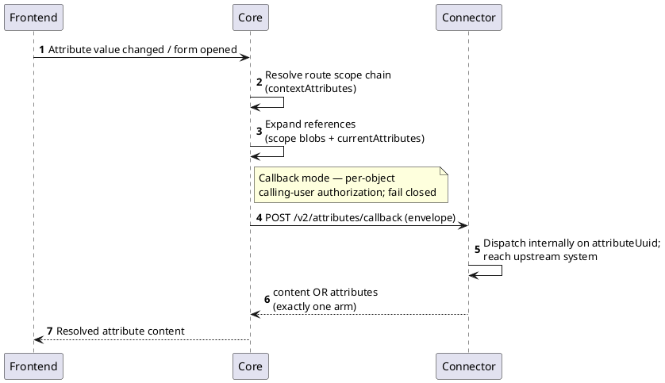
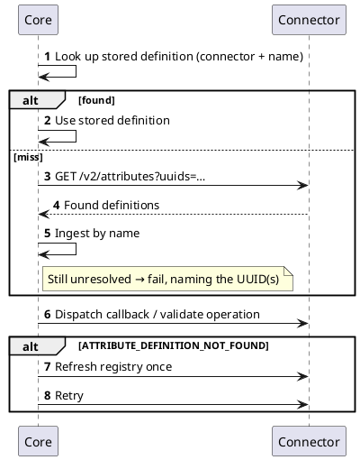

import Tabs from '@theme/Tabs';
import TabItem from '@theme/TabItem';

# Callbacks

An attribute callback loads an attribute's content **dynamically** — when the value of another attribute
changes, or when a form first opens — instead of the connector baking it into the static definition. A
certificate-template dropdown that repopulates when you pick a different authority is the canonical case.

Callbacks are declared on the
[`AttributeCallback`](https://github.com/OmniTrustILM/interfaces/blob/main/src/main/java/com/otilm/api/model/common/attribute/common/callback/AttributeCallback.java)
property of an attribute. The platform supports **two callback models** on that one property:

- the **legacy model** — a callback URL (`callbackContext`) plus `from`/`to`/`targets` mappings; used by
  stateful connectors (authority provider interface v1/v2); and
- the **Attributes v2 model** — a single `dependsOn` declaration and one shared callback endpoint; used by
  stateless (Connector NG) connectors that hold no per-instance state.

:::info[Attribute callbacks]
For the `attributeCallback` property on the attribute itself, see [Attributes](attributes.mdx).
:::

:::note[Annotated examples]
The JSON examples on this page carry annotations (`//`, `/* … */`, or `<--`) for explanation. These are
not valid JSON — strip the comments before copying a payload.
:::

## Choosing a model

`Core` selects the dispatch path **per callback, by declaration shape** — so a single connector may mix
both models and migrate incrementally.

| Aspect             | Legacy callback                                                     | Attributes v2 callback                                  |
|--------------------|--------------------------------------------------------------------|---------------------------------------------------------|
| Marker             | `callbackContext` present                                          | `dependsOn` present (even if empty)                     |
| Declaration        | `callbackContext` + `callbackMethod` + `mappings`                  | `dependsOn: List<String>`                               |
| Data wiring        | `from` / `to` / `targets` (path variable, query param, body)       | None — `Core` builds a typed envelope                   |
| Endpoint           | Per-callback URL template baked into the definition                | One shared `POST /v2/attributes/callback`               |
| Connection context | Instance UUID smuggled through the URL / a hidden helper attribute | `contextAttributes` scope chain, `Core`-injected        |
| Used by            | Stateful connectors (authority v1/v2)                              | Stateless / Connector NG connectors                     |

Setting **both** markers is invalid; a callback with **neither** defines no callback. The two models are
detailed below, followed by [how to migrate](#migrating-legacy-callbacks-to-attributes-v2).

## Legacy callback model

In some cases the content of an `Attribute` depends on the content of another `Attribute` or some other
aspect. The legacy `AttributeCallback` defines a callback URL that is triggered when the callback's mapping
rules are satisfied, letting a `Connector` load data from its technology without baking the content into
the definition.

### Callback properties

The [`AttributeCallback`](https://github.com/OmniTrustILM/interfaces/blob/main/src/main/java/com/otilm/api/model/common/attribute/common/callback/AttributeCallback.java) contains the following properties:

| Property          | Type                                                                                                                                                                                                       | Short description                                                                                                                               | Required                                      |
|-------------------|------------------------------------------------------------------------------------------------------------------------------------------------------------------------------------------------------------|-------------------------------------------------------------------------------------------------------------------------------------------------|-----------------------------------------------|
| `callbackContext` | `string`                                                                                                                                                                                                   | Context part of callback URL that should be used.                                                                                               | <span class="badge badge--danger">No</span>   |
| `callbackMethod`  | `string`                                                                                                                                                                                                   | HTTP method of the callback URL that should be used.                                                                                            | <span class="badge badge--danger">No</span>   |
| `mappings`        | set of [`AttributeCallbackMapping`](https://github.com/OmniTrustILM/interfaces/blob/main/src/main/java/com/otilm/api/model/common/attribute/common/callback/AttributeCallbackMapping.java) | Mappings for the callback method, which defines how to use the data in context of the request path variables, query parameter, or body payload. | <span class="badge badge--success">Yes</span> |

The complex structure, such as objects, arrays, etc., can be mapped only into the body payload of the callback. If the complex structure will be mapped as path variable or query parameter, only its `value` content property will be used.

The following is the sample `AttributeCallback` structure:

```json
{
  "callbackContext": "/v1/authorityProvider/{authorityUuid}/certificateTemplate",
  "callbackMethod": "GET",
  "mappings": [
    {
      "from": "authority.uuid", <-- this is the value of the Attribute 'authority' and its property 'uuid'
      "to": "authorityUuid",    <-- we want to put the value 'from' to the 'authorityUuid' as the path variable
      "targets": [
        "pathVariable"          <-- the name of the path variable should match the 'to' property
      ]
    }
  ]
}
```
:::info
Mappings have various options how to include the data from other `Attributes` and request additional action based on them. See the available options in [AttributeCallbackMapping](https://github.com/OmniTrustILM/interfaces/blob/main/src/main/java/com/otilm/api/model/common/attribute/common/callback/AttributeCallbackMapping.java).
:::

### Special purpose callbacks

The platform defines special purpose callbacks that are used for specific treatment of the `Attribute` content.

A typical example is the `DataAttribute` with the content type `CREDENTIAL` (V2) or `RESOURCE OBJECT` (V3). Working with the credentials, a typical use case is to push the credentials to the `Connector` that should be authenticated and authorized based on selected credential to specific technology. However, we do not want to reveal the secret and sensitive value of the credential to the `Client`.

For that purpose we have special callback interfaces that will give the `Client` credentials with the specific kind, however not the content. The content is protected by the platform.

### Supported special purpose callbacks

<table>

<tr>
<th>Callback</th>
<th>Description</th>
</tr>

<tr>
<td>

`coreGetCredentials`

</td>
<td>

```json
{
  "callbackContext": "core/getCredentials",
  "callbackMethod": "GET",
  "mappings": [
    {
      "to": "credentialKind",
      "targets": [
        "pathVariable"
      ],
      "value": "Basic"
    }
  ]
}
```
This callback allows to get the list of `Credentials` protecting its sensitive data. The list will contain only UUID and name of the `Credentials` that have the required `kind`.

:::warning[V2-only]
`coreGetCredentials` is applicable only for V2 attributes with `CREDENTIAL` content type. In V3, use the **Resource Callback** with `RESOURCE OBJECT` content type instead.
:::

</td>
</tr>

<tr>
<td>

Resource Callback

</td>
<td>

```json
{
  "mappings": [
    {
      "to": "COMMON_NAME.CONTAINS",
      "targets": [
        "filter"
      ],
      "value": "com"
    }
  ]
}
```
This callback is used to retrieve resource objects for attributes with `RESOURCE OBJECT` content type. The `callbackContext` and `callbackMethod` do not have to be specified, since this callback is called based on the content type.

Mappings serve to filter the resource objects retrieved from the Core database. Each mapping has the following format:

- `to` — filter expression in the format `{fieldIdentifier}.{operator}`. The available identifiers and operators for a specific resource can be retrieved by calling the API endpoint `/v1/{resource}/search`. The `fieldIdentifier` must be of field source `PROPERTY`.
- `targets` — must contain `"filter"`
- `value` — the value to filter by (can be omitted if `from` is specified)
- `from` — *(optional)* name of another attribute whose value should be used as the filter value instead of a static `value`

</td>
</tr>

</table>

### Callbacks construction samples

#### Mapping of the JSON object to the `AttributeCallback`

```mdx-code-block
<Tabs>
<TabItem value="java" label="Java">
```

```java
// definition of the AttributeCallback
AttributeCallback listValuesForAttributeTwoCallback = new AttributeCallback();
listValuesForAttributeTwoCallback.setCallbackContext("/v1/support/values");
listValuesForAttributeTwoCallback.setCallbackMethod("POST");
// map the selected object from attributeOne to callback and put it into body payload into the field with name selectedObject
Set<AttributeCallbackMapping> mappings = new HashSet<>();
mappings.add(new AttributeCallbackMapping(
        "attributeOne",
        "selectedObject",
        AttributeValueTarget.BODY));
listValuesForAttributeTwoCallback.setMappings(mappings);
attributeTwo.setAttributeCallback(listValuesForAttributeTwoCallback);
```

```mdx-code-block
</TabItem>
</Tabs>
```

#### Mapping of the JSON object field into the `AttributeCallback` path variables

```mdx-code-block
<Tabs>
<TabItem value="java" label="Java">
```

```java
// definition of the AttributeCallback
AttributeCallback listValuesForAttributeTwoCallback = new AttributeCallback();
listValuesForAttributeTwoCallback.setCallbackContext("/v1/support/{authorityId}/{customField}");
listValuesForAttributeTwoCallback.setCallbackMethod("GET");
// map the selected object value from attributeOne to callback and put it into path variable with name authorityId
// when the name of the Attribute only is specified, the value of the content is taken
Set<AttributeCallbackMapping> mappings = new HashSet<>();
mappings.add(new AttributeCallbackMapping(
        "attributeOne",
        "authorityId",
        AttributeValueTarget.PATH_VARIABLE));

// map the field custom from the selected object to callback and put it into path variable with name customField
mappings.add(new AttributeCallbackMapping(
        "attributeOne.data.custom",
        "customField",
        AttributeValueTarget.PATH_VARIABLE));
listValuesForAttributeTwoCallback.setMappings(mappings);
attributeTwo.setAttributeCallback(listValuesForAttributeTwoCallback);
```

```mdx-code-block
</TabItem>
</Tabs>
```

### Callbacks model

The following diagram represents the callbacks model. Details can be found in the [Interfaces repository](https://github.com/OmniTrustILM/interfaces/tree/main/src/main/java/com/otilm/api/model/common/attribute/common/callback).


```plantuml
@startuml
    scale 3/4
    left to right direction

    class AttributeCallback

    class AttributeCallbackMapping

    class AttributeValueTarget

    AttributeCallback *-- AttributeCallbackMapping : mappings
    AttributeCallbackMapping *-- AttributeValueTarget : targets
@enduml
```

## Attributes v2 callback model

The **Attributes v2 API** is a common interface — part of the `connector.common.v2` family (the versioned
interface namespace grouping the cross-cutting NG common interfaces: Info, Health, Metrics, and
Attributes) — that every stateless (Connector NG) connector implements. It resolves dynamic attribute
content (dropdown options, runtime-injected groups) without hand-written callback URLs, `from`/`to`/`targets`
mappings, or per-connector database state.

It has two halves:

- A **standard callback surface** — a connector declares a callback as just `dependsOn` (the attributes
  whose values it consumes) and implements a single `POST /v2/attributes/callback` endpoint. `Core`
  dispatches a typed envelope; the connector dispatches internally on the attribute.
- A **definition registry** — the connector's authoritative set of attribute definitions, addressable by
  UUID (`GET /v2/attributes`), that lets `Core` resolve any unknown or never-listed attribute definition on
  demand, instead of re-listing whole schemas.

:::warning[Read first — three independent version axes]
A bare "v2"/"v3" in this area is ambiguous. **"Attributes v2 API" is version 2 of the common
_connector interface_ (the NG generation marker) — it is _not_ attribute schema v2.**

- **Common-interface / NG generation** — the "v2" in `connector.common.v2` and in the `/v2/attributes`
  path. This is what "Attributes **v2** API" refers to.
- **Attribute schema version** — the `v2`/`v3` on the payload shapes (`RequestAttribute`,
  `BaseAttributeContentV3`, …).
- **Functional provider interface version** — e.g. authority provider `v3`, carried in the envelope as
  `interfaceVersion`.

A connector that exposes the Attributes v2 API is by definition a Connector NG (stateless) connector, but
the attribute **schemas** it carries may independently be schema v2 or v3. An Attributes v2 message
legitimately carries attribute schema v3 content — that is correct, not a bug.
:::

### Why stateless connectors need this

An attribute callback loads dynamic content when other attribute values change — for example, a
certificate-template dropdown on an RA-profile form. To produce that content the connector must reach its
upstream system (EJBCA, Vault), which needs the **connection blob** (URL + credentials) of the authority
or vault the form is configured under.

Legacy connectors (authority provider interface v1/v2) keep that blob in their own database, keyed by an
instance UUID that the callback bakes into its URL as a path variable — or smuggled through the form as a
hidden helper attribute. Stateless connectors (authority provider interface v3, secret provider) hold no
instance state, so there is nothing to look up: the callback hop must carry the connection blob itself.
The Attributes v2 API is the channel that carries it.

### API surface

`connector.common.v2`, path prefix `/v2/attributes`, auth-protected (payloads carry secrets). Endpoints
are **interface-agnostic** and keyed by the connector-global attribute UUID; the provider interface and
version ride the request body as `Core`-stamped context, never the path.

| Endpoint | Purpose |
|----------|---------|
| `GET /v2/attributes` | Full definition-registry dump → `AttributeDefinitionsDto`. |
| `GET /v2/attributes?uuids=…` | Batch lookup by UUID — repeat the parameter per UUID, e.g. `?uuids=e8ae4f6b-…&uuids=1c0f…`; returns the found-only subset, same DTO. |
| `GET /v2/attributes/{uuid}` | Single definition read; `404 ATTRIBUTE_DEFINITION_NOT_FOUND` if unknown. |
| `POST /v2/attributes/callback` | The standard callback surface — resolves dynamic content for one attribute. |

The contract is defined by [`AttributesController`](https://github.com/OmniTrustILM/interfaces/blob/main/src/main/java/com/otilm/api/interfaces/connector/common/v2/AttributesController.java).

:::info[API reference]
The `/v2/attributes` endpoints are added to the connector OpenAPI documents for each interface built on
`connector.common.v2` (authority provider v3, secret provider). Until those documents are published, use
the source contract linked above as the authoritative reference.
:::

### The `dependsOn` declaration model

An Attributes v2 callback is declared by adding **one** field — `dependsOn` — to the common
[`AttributeCallback`](https://github.com/OmniTrustILM/interfaces/blob/main/src/main/java/com/otilm/api/model/common/attribute/common/callback/AttributeCallback.java).
It lists, by name, the attributes _within the same form_ whose values this callback consumes and is
triggered by. The trigger set and the consumed-data set are **one concept** — `dependsOn` is the single
source of truth for both.

| Property          | Type           | Short description                                                                  | Required                                       |
|-------------------|----------------|-----------------------------------------------------------------------------------|------------------------------------------------|
| `dependsOn`       | `List<String>` | Names of the same-form attributes this Attributes v2 callback consumes/is triggered by. Presence marks the callback as Attributes v2. | <span class="badge badge--danger">No</span>   |
| `callbackContext` | `string`       | Legacy-only. Context part of the callback URL. Presence marks the callback as legacy. | <span class="badge badge--danger">No</span>   |

Declaration rules (enforced by the platform at definition ingestion):

- **At most one** of `dependsOn` / `callbackContext` may be set. Providing `dependsOn` — even as an empty
  list — marks the callback as an **Attributes v2** callback; `callbackContext` marks it as legacy.
- Setting **both** is invalid.
- A callback with **neither** field defines no callback.
- `dependsOn` is **not allowed on `RESOURCE`** attributes.
- An **empty (non-null) list means "fire once when the form opens"** — the callback depends on no other
  field (a scope-only dropdown that reads only the parent scope). This is the *fire-on-mount* case.


```json
{
  "dependsOn": [
    "authority"        // <-- the callback consumes and is triggered by the 'authority' attribute value
  ]
}
```

```json
{
  "dependsOn": []      // <-- empty (non-null) list: fire once when the form opens (scope-only dropdown)
}
```

### The callback envelope — two attribute channels

When a callback fires, `Core` builds an
[`AttributeCallbackRequestDto`](https://github.com/OmniTrustILM/interfaces/blob/main/src/main/java/com/otilm/api/model/client/connector/v2/attribute/AttributeCallbackRequestDto.java)
and `POST`s it to `/v2/attributes/callback`. The connector dispatches internally on `attributeUuid`.

| Property             | Type                       | Short description                                                                  | Required                                       |
|----------------------|----------------------------|-----------------------------------------------------------------------------------|------------------------------------------------|
| `connectorInterface` | `ConnectorInterface`       | Provider interface the triggering schema belongs to. `Core`-stamped from `/v2/info`. | <span class="badge badge--success">Yes</span> |
| `interfaceVersion`   | `string`                   | Version of the provider interface (e.g. authority `"v3"`). `Core`-stamped.        | <span class="badge badge--success">Yes</span> |
| `attributeUuid`      | `UUID`                     | Connector-global UUID of the attribute whose callback fired — the dispatch key.   | <span class="badge badge--success">Yes</span> |
| `attributeName`      | `string`                   | Name of the attribute whose callback fired. Informative / logging.                | <span class="badge badge--success">Yes</span> |
| `contextAttributes`  | list of `ScopedAttributes` | Route scope chain, credentials expanded inline. Empty when the form has no parent scope. | <span class="badge badge--success">Yes</span> |
| `currentAttributes`  | list of `RequestAttribute` | The `dependsOn`-named form values only, references expanded inline.               | <span class="badge badge--success">Yes</span> |
| `pagination`         | `PaginationRequestDto`     | Optional pagination for content responses.                                        | <span class="badge badge--danger">No</span>   |

The two attribute channels are the core of the design:

- **`contextAttributes`** — the **route scope chain**. `Core` injects these from its own database
  (credentials expanded inline); the connector never influences which scopes arrive. The route the form
  lives under determines them (e.g. the authority for an RA-profile form). Each link is a
  [`ScopedAttributes`](https://github.com/OmniTrustILM/interfaces/blob/main/src/main/java/com/otilm/api/model/client/connector/v2/attribute/ScopedAttributes.java):

  | Property     | Type                       | Short description                                                              | Required                                       |
  |--------------|----------------------------|-------------------------------------------------------------------------------|------------------------------------------------|
  | `scope`      | `Resource`                 | Kind of the scope object, serialized as the plural resource code (`"authorities"`, `"raProfiles"`, …). | <span class="badge badge--success">Yes</span> |
  | `objectUuid` | `UUID`                     | UUID of the scope object — for correlation/logging only, never a connector-side lookup key. | <span class="badge badge--danger">No</span>   |
  | `attributes` | list of `RequestAttribute` | Credential-expanded attributes of the scope object.                           | <span class="badge badge--success">Yes</span> |

- **`currentAttributes`** — the **`dependsOn`-named form values only** (not the whole form), supplied by
  the frontend, with reference-typed values expanded inline by `Core`. Scoping to `dependsOn` minimises
  secret exposure and surfaces missing-dependency bugs at connector development time. A fire-on-mount
  callback (`dependsOn: []`) still sends `currentAttributes: []`.

Both channels carry the platform's polymorphic `RequestAttribute` (attribute schema v2 or v3) — the same
wire shape used by authority-v3 operation requests.

```json
{
  "connectorInterface": "authority",   // <-- Core-stamped from /v2/info; connector does not supply it
  "interfaceVersion": "v3",                     // <-- functional provider interface version (a separate axis)
  "attributeUuid": "e8ae4f6b-…",                // <-- dispatch key; matches the connector's registry
  "attributeName": "data_certificateTemplate",
  "contextAttributes": [
    {
      "scope": "authorities",                   // <-- plural resource code of the parent scope
      "objectUuid": "1c0f…",                    // <-- correlation only
      "attributes": [ /* authority connection blob, credentials already expanded by Core */ ]
    }
  ],
  "currentAttributes": [ /* only the dependsOn-named form values, references expanded */ ]
}
```

### The scope chain `Core` injects

`Core` resolves `contextAttributes` from the route the form lives under, walking parent to child:

| Resource            | Injected scope chain            |
|---------------------|---------------------------------|
| `RA_PROFILE`        | `[authority]`                   |
| `CERTIFICATE`       | `[authority, raProfile]`        |
| `TOKEN_PROFILE`     | `[tokenInstance]`               |
| `CRYPTOGRAPHIC_KEY` | `[tokenInstance, tokenProfile]` |
| `LOCATION`          | `[entity]`                      |
| connector-scoped    | `[]` (no parent scope)          |

### Automatic reference expansion

Reference-typed values (credentials and other stored `RESOURCE` objects) are expanded to their full
material by `Core` — automatically, with no per-callback declaration — in **both** the scope blobs
(`contextAttributes`) and the `currentAttributes`. Multi-select references expand per element; expansion
is recursive, cycle-safe, and depth-capped. Kinds without a connector-consumable blob pass through as
plain references.

`Core` authorizes every referenced object before expanding it, per the calling user, and **fails closed**
— a callback returns `403` if the caller lacks rights to any selected object (including in a multi-select).
The connector always receives references already expanded (or the request already rejected); it performs
no authorization of its own.

:::danger[Secret-handling contract]
User-typed secrets flow frontend → `Core` → connector on first delivery; stored secrets enter the
connector **only** via `Core`-side expansion. **No callback response toward the frontend may carry secret
content.** A connector must never echo an expanded secret back in its `content`/`attributes` response.
This binding rule on the connector — backed by its startup registry self-validation — is the primary
guarantee. `Core` additionally enforces it fail-closed on ingest: a callback response carrying
secret-bearing content is **rejected** (`OutboundSecretLeakException`), not masked — the violation
surfaces rather than being silently stripped.
:::

### The callback response

The connector answers with an
[`AttributeCallbackResponseDto`](https://github.com/OmniTrustILM/interfaces/blob/main/src/main/java/com/otilm/api/model/client/connector/v2/attribute/AttributeCallbackResponseDto.java).
**Exactly one arm** is set:

| Property     | Type                          | Short description                                                        | Required                                     |
|--------------|-------------------------------|--------------------------------------------------------------------------|----------------------------------------------|
| `content`    | list of `BaseAttributeContentV3<?>` | Resolved dropdown options for a `DATA` attribute. Always attribute schema **v3**. | <span class="badge badge--danger">One of</span> |
| `attributes` | list of `BaseAttribute`       | Runtime-injected `GROUP` children definitions.                           | <span class="badge badge--danger">One of</span> |
| `totalItems` | `Long`                        | Total items available, for paginated content responses.                  | <span class="badge badge--danger">No</span> |

- Set `content` for a `DATA`-attribute dropdown, or `attributes` to return `GROUP` children — never both,
  never neither.
- An **empty-but-non-null** list counts as "set": `content: []` legitimately means "resolved to zero
  options".
- The `content` arm is pinned to **attribute schema v3** even when the triggering definition is schema v2
  (per the version-axis rule above). Do not "correct" it to a v2 content type.

:::warning[Connectors must self-enforce the one-arm rule]
The exactly-one-arm invariant is declared as a bean-validation rule, but frameworks generally do not run
JSR-380 validation on _outbound_ response bodies. The connector must guarantee it sets exactly one arm;
`Core` validates the response on receipt.
:::

#### Reporting errors from a callback

When the connector cannot resolve content — the callback input is semantically unusable, or the upstream
system fails — it returns an `application/problem+json` error following the NG
[Error Handling](../../certificate-key/connectors/error-handling.md) specification (RFC 9457). Use
`422 VALIDATION_FAILED` for input the connector cannot act on; the error surfaces to the caller through
`Core`'s standard error rendering.

### The definition registry

The registry (`GET /v2/attributes`, returning an
[`AttributeDefinitionsDto`](https://github.com/OmniTrustILM/interfaces/blob/main/src/main/java/com/otilm/api/model/client/connector/v2/attribute/AttributeDefinitionsDto.java))
is the connector's authoritative set of attribute definitions, addressable by UUID.

| Property           | Type                    | Short description                                                       | Required                                     |
|--------------------|-------------------------|------------------------------------------------------------------------|----------------------------------------------|
| `connectorVersion` | `string`                | Connector build version, echoed so `Core` can detect staleness. A version string, not a content hash. | <span class="badge badge--success">Yes</span> |
| `definitions`      | list of `BaseAttribute` | Attribute definitions, polymorphic across attribute schema v2/v3.      | <span class="badge badge--success">Yes</span> |

Registry rules:

- One attribute UUID maps to **exactly one definition** across all attribute types, for a given connector
  build.
- Definitions carry **static default content only** — dynamic content is produced by the callback.
- A `GROUP` definition is returned as **the group itself, never its children**.

**Definition resolution ladder.** For callback dispatch and identically for operation-time validation,
`Core` resolves definitions name-keyed, with a registry fallback on cache miss:

```
stored definition (Core, keyed by connector + name)
  └─ miss → GET /v2/attributes?uuids=…   (fetch by UUID from the connector, ingest by name)
       └─ still unresolved → 422 VALIDATION_FAILED to the caller, naming the unresolved UUID(s)
```

On the Attributes v2 path `Core` does not re-derive definitions by re-listing per-operation schemas (the
legacy UI-flow behavior); the resolution ladder above fetches only the missing UUIDs. The **one** exception
is a connector-signalled `ATTRIBUTE_DEFINITION_NOT_FOUND` (a `CONNECTOR`-general error, HTTP `404`,
non-retryable): `Core` then refreshes that connector's **whole registry once** and retries. This
cache-miss path is what lets `Core` resolve definitions it has never listed — API-only clients,
never-materialised `GROUP` children, metadata referenced by content mapping.

:::info[Staleness — planned]
Correctness today rests on the **cache-miss path** above plus the existing **manual connector
reconnect/reload** (which forces a full re-fetch and covers connector upgrades). Automatic
**build-version staleness detection** (auto-refetching when `connectorVersion` changes) and
**orphan/drift cleanup** of definitions a connector stops emitting are **planned as a fast-follow and
are not yet available**. The registry already carries `connectorVersion` so the signal is ready.
:::

### Conformance and startup self-validation

**Definition-identity conformance rule.** One UUID + name ⇒ one definition shape per connector build.
Semantic variants require a **new UUID**; per-scope differences are expressed by _composition_ (which
attributes appear, what content they carry), never by shape variance for the same UUID. This makes
connector-global definition storage correct by construction — re-storing the same shape is idempotent.

**Startup self-validation.** Because the connector fleet is polyglot (Java, Go, Python), there is no
shared conformance test-jar. Instead, each connector **must validate its own registry at startup and fail
fast** if it is inconsistent — specifically:

- attribute UUIDs are unique across all attribute types, and
- every attribute named by another attribute's `dependsOn` declaration is itself dispatchable.

:::info[`RequestAttribute.version`]
`RequestAttribute.version` stays **optional** for backward compatibility (it defaults to schema v2), so
existing connectors that omit it keep working. Attribute **schema v3** attributes must set `version`
explicitly.
:::

### Putting it together — a worked example

A certificate-template dropdown (`data_certificateTemplate`) on an RA-profile form, served by a stateless
authority provider v3 connector. It reads only the parent authority's connection blob, so it declares an
**empty** `dependsOn` — it fires once when the form opens.

**1. Registry definition** (returned by `GET /v2/attributes`, abbreviated):

```json
{
  "uuid": "e8ae4f6b-…",
  "name": "data_certificateTemplate",
  "type": "data",
  "contentType": "string",
  "attributeCallback": {
    "dependsOn": []          // <-- fire-on-mount: depends only on the parent authority scope
  }
}
```

**2. Envelope `Core` `POST`s to `/v2/attributes/callback`** when the form opens:

```json
{
  "connectorInterface": "authority",
  "interfaceVersion": "v3",
  "attributeUuid": "e8ae4f6b-…",
  "attributeName": "data_certificateTemplate",
  "contextAttributes": [
    {
      "scope": "authorities",
      "objectUuid": "1c0f…",
      "attributes": [ /* authority URL + credentials, expanded inline by Core */ ]
    }
  ],
  "currentAttributes": []    // <-- empty: the callback depends on no in-form field
}
```

**3. Connector response** — dispatch on `attributeUuid`, query the upstream authority using the connection
blob from `contextAttributes`, return the resolved options in the `content` arm. Each content item carries
the `contentType` discriminator (always present on the wire):

```json
{
  "content": [
    { "reference": "TLS Server", "data": "tls-server", "contentType": "string" },
    { "reference": "TLS Client", "data": "tls-client", "contentType": "string" }
  ]
}
```

#### A callback that depends on other fields

When the callback consumes in-form values, list them in `dependsOn`; `Core` sends exactly those, matched
by name, in `currentAttributes`. For a template that depends on the selected `profile`:

```json
{
  "attributeCallback": {
    "dependsOn": ["profile"]    // <-- triggered by, and consumes, the 'profile' field
  }
}
```

`Core` then includes the `profile` value in the envelope — the entry `name` equals the `dependsOn` string:

```json
{
  "currentAttributes": [
    { "name": "profile", "contentType": "string", "content": [ { "data": "web-servers" } ] }
  ]
}
```

#### Returning `GROUP` children

A `GROUP`-attribute callback sets the `attributes` arm instead of `content`, returning the child
definitions to inject at runtime (each a `BaseAttribute`). For large `content` results, set `totalItems`
and honour the request's `pagination`.

### Implementing it with the go-sdk

The [go-sdk](https://github.com/OmniTrustILM/go-sdk) ships the Attributes v2 surface as
`connector/provider/attributes/v2`: you declare a static registry of definitions — each an attribute plus
an optional callback resolver — and `NewHandler` builds the `GET /v2/attributes*` and
`POST /v2/attributes/callback` routes. It **self-validates the registry at startup and fails fast**, so
the conformance rules above (unique UUIDs, every `dependsOn` attribute dispatchable) are enforced before
the connector serves.

```go
import (
	mdl "github.com/OmniTrustILM/go-sdk/connector/model/attributes/v2"
	attributes "github.com/OmniTrustILM/go-sdk/connector/provider/attributes/v2"
	"github.com/OmniTrustILM/go-sdk/connector/shared"
)
```

Declare the dynamic dropdown from the worked example — a `data_certificateTemplate` that depends on the
in-form `profile` field:

```go
const templateAttrUUID = "e8ae4f6b-2c1a-4d3e-9f70-1a2b3c4d5e6f"

func templateDropdown() mdl.BaseAttributeDto {
	d := mdl.NewDataAttributeV3(
		templateAttrUUID, "data_certificateTemplate", 3,
		mdl.ATTRIBUTETYPE_DATA, mdl.ATTRIBUTECONTENTTYPE_STRING,
		*mdl.NewDataAttributeProperties("Certificate Template",
			true /* visible */, true /* required */, false /* readOnly */,
			true /* list */, false /* multiSelect */, false /* extensibleList */),
		mdl.ATTRIBUTEVERSION_V3,
	)
	// dependsOn marks this an Attributes v2 callback attribute.
	// Use []string{} for a fire-on-mount, scope-only dropdown.
	d.AttributeCallback = &mdl.AttributeCallback{DependsOn: []string{"profile"}}
	w := mdl.DataAttributeV3AsBaseAttributeDtoV3(d)
	return mdl.BaseAttributeDtoV3AsBaseAttributeDto(&w)
}
```

Implement the resolver — read the parent authority blob from `contextAttributes` and the `profile` value
from `currentAttributes`, then return the options in the content arm. `ContentResponse` sets exactly one
arm for you:

```go
func resolveTemplates(ctx context.Context, req *mdl.AttributeCallbackRequestDto) (*mdl.AttributeCallbackResponseDto, error) {
	// contextAttributes: Core-injected scope chain (walk to scope "authorities");
	// credentials are already expanded inline.
	authorityBlob := req.ContextAttributes

	// currentAttributes: only the dependsOn-named form values, matched by name.
	profile, ok := firstString(req.CurrentAttributes, "profile")
	if !ok {
		// no profile yet → explicit empty list ("resolved to zero options"), not null
		return attributes.ContentResponse([]mdl.BaseAttributeContentDtoV3{}, nil), nil
	}

	// your connector's logic — build each entry with option(label, value) below
	options := queryUpstreamTemplates(authorityBlob, profile)
	return attributes.ContentResponse(options, nil), nil
}

func option(label, value string) mdl.BaseAttributeContentDtoV3 {
	c := mdl.StringAttributeContentV3{
		Reference:   &label, // shown in the dropdown
		Data:        value,  // submitted value
		ContentType: mdl.ATTRIBUTECONTENTTYPE_STRING,
	}
	return mdl.StringAttributeContentV3AsBaseAttributeContentDtoV3(&c)
}

func firstString(attrs []mdl.RequestAttribute, name string) (string, bool) {
	for _, a := range attrs {
		if v3 := a.RequestAttributeV3; v3 != nil && v3.Name == name && len(v3.Content) > 0 {
			if s := v3.Content[0].StringAttributeContentV3; s != nil {
				return s.Data, true
			}
		}
	}
	return "", false
}
```

Register the handler alongside the connector's functional interface — `NewHandler` returns an error if the
registry is inconsistent, so a misconfigured connector never starts:

```go
h, err := attributes.NewHandler(connectorVersion, []attributes.Definition{
	{Attribute: templateDropdown(), Callback: resolveTemplates}, // dynamic (has dependsOn)
	// {Attribute: staticCaName()},                              // static: nil Callback
})
if err != nil {
	return err // e.g. a dependsOn naming an attribute the registry doesn't contain
}

c, err := shared.New(shared.Register(functionalHandler), shared.Register(h))
// serve c.Handler() on your http.Server
```

### How it works

Two flows, recapped visually — a callback firing when a dependency changes, and how `Core` resolves a
definition it has not cached.

#### Attributes v2 callback dispatch


```plantuml
@startuml
autonumber
    Frontend -> Core : Attribute value changed / form opened
    Core -> Core : Resolve route scope chain\n(contextAttributes)
    Core -> Core : Expand references\n(scope blobs + currentAttributes)
    note right of Core: Callback mode — per-object\ncalling-user authorization; fail closed
    Core -> Connector : POST /v2/attributes/callback (envelope)
    Connector -> Connector : Dispatch internally on attributeUuid;\nreach upstream system
    Connector --> Core : content OR attributes\n(exactly one arm)
    Core --> Frontend : Resolved attribute content
@enduml
```

#### Definition resolution with cache-miss


```plantuml
@startuml
autonumber
    Core -> Core : Look up stored definition (connector + name)
    alt found
        Core -> Core : Use stored definition
    else miss
        Core -> Connector : GET /v2/attributes?uuids=…
        Connector --> Core : Found definitions
        Core -> Core : Ingest by name
        note right of Core: Still unresolved → fail, naming the UUID(s)
    end
    Core -> Connector : Dispatch callback / validate operation
    alt ATTRIBUTE_DEFINITION_NOT_FOUND
        Core -> Connector : Refresh registry once
        Core -> Connector : Retry
    end
@enduml
```

## Migrating legacy callbacks to Attributes v2

`Core` selects the dispatch path **per callback, by declaration shape** (see
[Choosing a model](#choosing-a-model)), so a single connector may mix legacy and Attributes v2 callbacks
and migrate incrementally.

To migrate a callback:

1. Remove `callbackContext`, `callbackMethod`, and `mappings`.
2. Add `dependsOn` listing the same-form attributes the callback consumes (or `[]` for a scope-only,
   fire-on-mount dropdown).
3. Implement the single `POST /v2/attributes/callback` endpoint, dispatching internally on
   `attributeUuid`; read the parent connection blob from `contextAttributes` and the triggering values
   from `currentAttributes`.
4. Ensure the connector's registry passes startup self-validation (unique UUIDs; every `dependsOn`
   attribute dispatchable).

:::info[Connector adoption]
Migrating any specific connector (EJBCA, the secret provider, others) is a separate per-connector effort,
including connector-side prerequisites such as ensuring attribute UUIDs are unique.
:::
