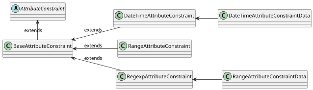

import Tabs from '@theme/Tabs';
import TabItem from '@theme/TabItem';

# Constraints

Constraints define set of rules that are applied for validation of the `Attribute` content as input. The `Attribute` content is validated when the `Attribute` is created or updated. Validation is controlled consistently by the platform and ensures that the `Attribute` content is valid and can be used for further processing.

:::info[Attributes that support constraints]
For more information about `Attribute` types that support constraints, see [Attributes](attributes.mdx).
:::

## Constraint properties

Every constraint is extended from the base class of [`BaseAttributeConstraint`](https://github.com/CZERTAINLY/CZERTAINLY-Interfaces/blob/master/src/main/java/com/czertainly/api/model/common/attribute/v2/constraint/BaseAttributeConstraint.java) which is abstracted from [`AttributeConstraint`](https://github.com/CZERTAINLY/CZERTAINLY-Interfaces/blob/master/src/main/java/com/czertainly/api/model/common/attribute/v2/constraint/AttributeConstraint.java).

The constraint has the following properties defined and inherited from the `BaseAttributeConstraint`:

| Property       | Type                                                      | Short description                                             | Required                                      |
|----------------|-----------------------------------------------------------|---------------------------------------------------------------|-----------------------------------------------|
| `description`  | `string`                                                  | Description of the constraint                                 | <span class="badge badge--danger">No</span>   |
| `errorMessage` | `string`                                                  | Error message to be displayed when the constraint is violated | <span class="badge badge--danger">No</span>   |
| `type`         | [`AttributeConstraintType`](#supported-constraints-types) | Type of the constraint                                        | <span class="badge badge--success">Yes</span> |
| `data`         | `AttributeConstraint`                                     | Data to be used for the constraint                            | <span class="badge badge--success">Yes</span> |

## Supported constraints types

Supported constraint types are defined in the [`AttributeConstraintType`](https://github.com/CZERTAINLY/CZERTAINLY-Interfaces/blob/master/src/main/java/com/czertainly/api/model/common/attribute/v2/constraint/AttributeConstraintType.java). The following content types are available and supported:

| `AttributeConstraintType` | Class                                                                                                                                                                                                   | Data                                                                                                                                                                                                                 |
|---------------------------|---------------------------------------------------------------------------------------------------------------------------------------------------------------------------------------------------------|----------------------------------------------------------------------------------------------------------------------------------------------------------------------------------------------------------------------|
| `REGEXP`                  | [`RegexpAttributeConstraint`](https://github.com/CZERTAINLY/CZERTAINLY-Interfaces/blob/master/src/main/java/com/czertainly/api/model/common/attribute/v2/constraint/RegexpAttributeConstraint.java)     | `string`                                                                                                                                                                                                             |
| `RANGE`                   | [`RangeAttributeConstraint`](https://github.com/CZERTAINLY/CZERTAINLY-Interfaces/blob/master/src/main/java/com/czertainly/api/model/common/attribute/v2/constraint/RangeAttributeConstraint.java)       | [`RangeAttributeConstraintData`](https://github.com/CZERTAINLY/CZERTAINLY-Interfaces/blob/master/src/main/java/com/czertainly/api/model/common/attribute/v2/constraint/data/RangeAttributeConstraintData.java)       |
| `DATETIME`                | [`DateTimeAttributeConstraint`](https://github.com/CZERTAINLY/CZERTAINLY-Interfaces/blob/master/src/main/java/com/czertainly/api/model/common/attribute/v2/constraint/DateTimeAttributeConstraint.java) | [`DateTimeAttributeConstraintData`](https://github.com/CZERTAINLY/CZERTAINLY-Interfaces/blob/master/src/main/java/com/czertainly/api/model/common/attribute/v2/constraint/data/DateTimeAttributeConstraintData.java) |

## Constraint type description and samples

### `RegExpAttributeConstraint`

Use this constraint when the content needs to be validated against a regular expression.

```mdx-code-block
<Tabs>
<TabItem value="json" label="JSON">
```

```json
{
    "description": "Alphanumeric Regex Constraint",
    "errorMessage": "Only alphanumeric characters are allowed",
    "type": "RegExp",
    "data": "^[a-zA-Z0-9]*$"
}
```

```mdx-code-block
</TabItem>

<TabItem value="java" label="Java">
```

```java
AttributeConstraint constraint = new RegexpAttributeConstraint()
constraint.setDescription("Alphanumeric Regex Constraint")
constraint.setErrorMessage("Only alphanumeric characters are allowed")
constraint.setData("^[a-zA-Z0-9]*$");
constraint.setType(AttributeConstraintType.REGEXP);
```

```mdx-code-block
</TabItem>
</Tabs>
```

### `RangeAttributeConstraint`

Use this constraint when the content needs to be validated against a range of integers.

```mdx-code-block
<Tabs>
<TabItem value="json" label="JSON">
```

```json
{
    "description": "Range Constraint",
    "errorMessage": "Value should be between 1 and 10",
    "type": "range",
    "data": {
        "from": 1,
        "to": 10
    }
}
```

```mdx-code-block
</TabItem>

<TabItem value="java" label="Java">
```
    
```java
RangeAttributeConstraintData data = new RangeAttributeConstraintData();
data.setFrom(1);
data.setTo(10);

RangeAttributeConstraint constraint = new RangeAttributeConstraint();
constraint.setDescription("Range Constraint");
constraint.setErrorMessage("Value should be between 1 and 10");
constraint.setData(data);
constraint.setType(AttributeConstraintType.RANGE);
```

```mdx-code-block
</TabItem>
</Tabs>
```

### `DateTimeAttributeConstraint`

Use this constraint when you need to validate date and time.

```mdx-code-block
<Tabs>
<TabItem value="json" label="JSON">
```

```json
{
    "description": "Date Time Constraint",
    "errorMessage": "Value should be between 1 and 10",
    "type": "datetime",
    "data": {
        "from": "2020-01-01T00:00:00.000Z",
        "to": "2020-12-31T00:00:00.000Z"
    }
}
```

```mdx-code-block
</TabItem>

<TabItem value="java" label="Java">
```
    
```java
DateTimeAttributeConstraintData data = new DateTimeAttributeConstraintData();
data.setFrom(LocalDateTime.now());
data.setTo(LocalDateTime.of(2023, Month.JULY, 29, 19, 30, 40));

DateTimeAttributeConstraint constraint = new DateTimeAttributeConstraint();
constraint.setDescription("Date Time Constraint");
constraint.setErrorMessage("Value should be between the provided range");
constraint.setData(data);
constraint.setType(AttributeConstraintType.DATETIME);
```

```mdx-code-block
</TabItem>
</Tabs>
```

## Constraint model

The following diagram represents the constraint model inherited from the `AttributeConstraint`. Details can be found in the [CZERTAINLY Interfaces repository](https://github.com/CZERTAINLY/CZERTAINLY-Interfaces/tree/master/src/main/java/com/czertainly/api/model/common/attribute/v2/constraint).

