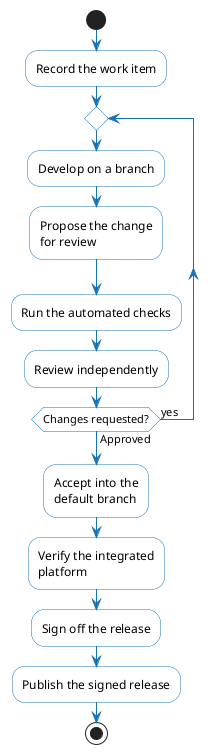

# Development Lifecycle

**ILM** is developed in the open across the repositories of the [OmniTrustILM](https://github.com/OmniTrustILM) organization. Every change is traceable to a work item and a reviewed pull request, and the controls of the lifecycle leave their evidence in the repositories themselves — so a reader who needs to confirm rather than trust can inspect it directly.

## How to use this section

**Contributors** wanting to get a change accepted find the contribution process and the review it goes through here.

- [Contribution and Change](./contribution-and-change.md)
- [Quality and Review](./quality-and-review/overview.md)

**Users, security reviewers and auditors** wanting to establish how the platform is developed and find the evidence for it start here, with the control catalog, its mapping to external frameworks, and further supply-chain and vulnerability-handling detail.

- [Controls and Evidence](./controls-and-evidence.md)
- [Standards Mapping](./standards-mapping/overview.md)
- [Supply Chain](./supply-chain.md) and [Vulnerability Management](./vulnerability-management.md) for detail

## Lifecycle phases

A change passes through six phases. They are disciplines rather than rigid stages — several run in parallel, and the cycle is iterative: what is learned in operation feeds back into planning.

The diagram below traces the path a single change takes, from work item to published release:

### Planning and requirements

Every change starts as a work item — see [Contribution and Change](./contribution-and-change.md) for what it records and how it is triaged.

### Design and analysis

Work item templates provide a section for security and compliance constraints, and work large enough to carry design risk is analyzed and decomposed under review before implementation begins.

### Implementation

The change is developed on a branch and submitted as a pull request linked to its work item — see [Contribution and Change](./contribution-and-change.md) for how it is reviewed, accepted, and merged.

### Testing and verification

Every pull request passes automated checks before it can be merged, and functional verification of the integrated platform runs beyond the individual change, on environments created for it and on a schedule. See [Quality and Review](./quality-and-review/overview.md).

### Release

Completed work ships in versioned releases, gated by declared sign-off criteria and published with the exact source revision of every component recorded. The project has adopted a quarterly cadence for feature releases, effective from the next release cycle; between feature releases, patch releases are published as needed, carrying only security fixes and bug fixes. See [Release, Versioning and Support](./release-versioning-and-support.md).

### Operations and maintenance

Released versions are maintained by patch releases carrying only fixes. A defect found in released functionality is filed as a work item and follows the standard lifecycle, dependencies are monitored continuously and updated through the normal change flow, and reported vulnerabilities are assessed and disclosed — see [Vulnerability Management](./vulnerability-management.md).

## Quality gates

Progress through the lifecycle is guarded by gates enforced by a combination of automation and human review. The **Controls** column links to the controls in [Controls and Evidence](./controls-and-evidence.md) that enforce each gate.

| Gate | Where it applies | Enforced by | Controls |
|---|---|---|---|
| **Scoping** | Before implementation begins | Acceptance criteria for work that adds or changes functionality; larger work is analyzed and decomposed under review | [DL-02 Work item and traceability](./controls-and-evidence.md#dl-02) [DL-12 Constraints and decomposition](./controls-and-evidence.md#dl-12) |
| **Code review** | Before a pull request can be merged | A pull-request-only path to the default branch, and approval by an independent reviewer, including an owner of the affected code | [DL-03 Pull-request-only path](./controls-and-evidence.md#dl-03) [DL-04 Independent approval](./controls-and-evidence.md#dl-04) |
| **Acceptance** | Before a pull request can be merged | Verification against the work item's acceptance criteria | [DL-26 Acceptance verification](./controls-and-evidence.md#dl-26) |
| **CI checks** | On every pull request | Automated build, tests, and static analysis, declared per repository as required checks | [DL-06 Declared required checks](./controls-and-evidence.md#dl-06) [DL-07 Build and tests](./controls-and-evidence.md#dl-07) [DL-08 Static security analysis](./controls-and-evidence.md#dl-08) [DL-09 Code quality gate](./controls-and-evidence.md#dl-09) |
| **Verification** | Beyond the individual change, on environments created for it and on a schedule | Automated and functional verification of the integrated platform | [DL-11 Integrated verification](./controls-and-evidence.md#dl-11) |
| **Release sign-off** | Before a release is published | Declared sign-off criteria and review of open defects | [DL-20 Release sign-off](./controls-and-evidence.md#dl-20) |

## In this section

- [Contribution and Change](./contribution-and-change.md) — how a change moves from a work item to the default branch, and the controls each repository enforces along the way.
- [Quality and Review](./quality-and-review/overview.md) — the Quality and Review policy: goals, scope, principles, and code review.
- [Secure Development](./secure-development.md) — how security practices and infrastructure controls run through development itself.
- [Supply Chain](./supply-chain.md) — dependencies, bills of materials, build integrity, and how to verify a release's signatures.
- [Release, Versioning and Support](./release-versioning-and-support.md) — release cadence, versioning, scope gates, and support of released versions.
- [Vulnerability Management](./vulnerability-management.md) — how a vulnerability is reported, assessed, and disclosed.
- [Controls and Evidence](./controls-and-evidence.md) — the control catalog: what enforces each control and where its evidence lives.
- [Standards Mapping](./standards-mapping/overview.md) — which deployer obligations the platform's development discharges, mapped to external frameworks.
