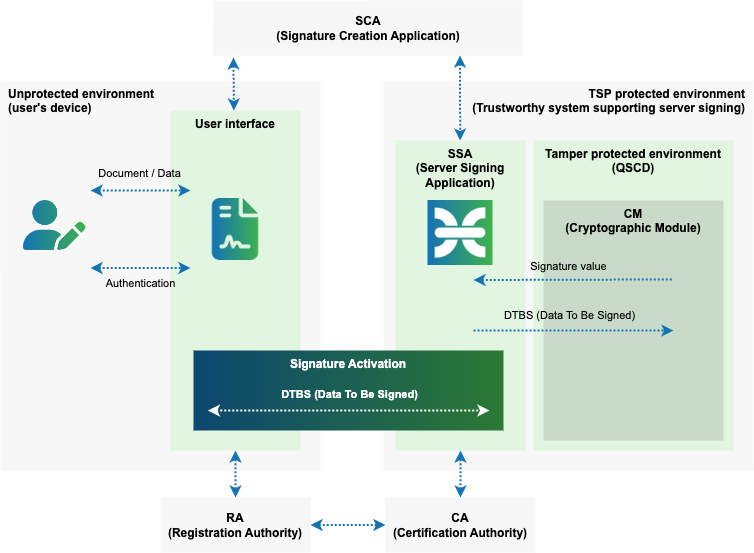
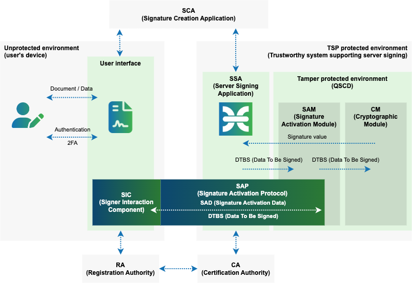

# Sole Control Assurance Level

**EN 419 241-1 identifies two levels of sole control assurance:**

## Sole Control Assurance Level 1 (SCAL1)

- The signing keys are used, with a low level of confidence, under the sole control of the signer.
- The authorized signer’s use of its key for signing is enforced by the Server Signing Application Service Component which authenticates the signer. The activation of the signing key can remain for a given period and/or for a given number of signatures.

In case of SCAL1, user relies on the server signing application to ensure that the appropriate signing key is selected. The functionality supporting signature activation and ensuring sole control is implemented as part of the server signing application.

## Sole Control Assurance Level 1 (SCAL2)

- The signing keys are used, with a high level of confidence, under the sole control of the signer.
- The authorized signer’s use of its key for signing is enforced by the signature activation module by means of signature activation data provided, by the signer, using a signature activation protocol, in order to enable the use of the corresponding signing key to sign specific documents.

SCAL2 provides greater assurance of sole control by requiring code within the HSM to implement signature activation, called signature activation module. This code is certified to the same security level as the HSM’s general cryptographic functions. The signature activation data passes, in protected form using the signature activation protocol, from the signer’s device to the HSM to ensure that the user’s signing keys can’t be abused, even if the TSP’s server signing application were to be compromised.

