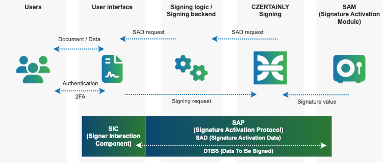

# SAM Crypto Token

Remote signing using with the SCAL2 and the CZERTAINLY Signing is possible by integrating the SAM and the signing back-end of the remote signing solution. We call it **SAMCryptoToken**. It is a special implementation of the of the CryptoToken for the CZERTAINLY Signing, which contains necessary functions and interfaces to communicate with the SAM and the user’s device.

What is happening when user would like to sign the data within the context of the CZERTAINLY Signing and SCAL2? The typical signature process is as follows:

- Request to sign the data is triggered from the the client
- Signer prepares the Data To Be Signed and asks the signing back-end to confirm by the user
- User confirms the Data To Be Signed and activates the private key for the signing operation
- QSCD + SAM verifies the request and produces the signature
- Signer completes the operation and provides the result