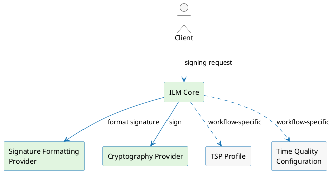

# Concepts

ILM-native signing is the platform's built-in digital signing capability — a self-contained solution with no external dependency such as SignServer. It builds on the same infrastructure and configuration you already have in place.

ILM supports standard signing workflows and, for EU deployments, **qualified electronic signatures and timestamps** under eIDAS and the **ETSI EN 319 42x** family. For a full breakdown of which standards apply and how each maps to an ILM mechanism, see the standards and compliance page for the relevant workflow.

:::tip
If you are already using the SignServer-based implementation, it continues to be supported throughout the transition. See [Digital Signing — SignServer](/docs/signserver/introduction).
:::

---

## Components

ILM-native signing is built around a small set of collaborating components. You send your request to ILM Core — Core takes care of the rest, coordinating with the connectors on your behalf.

**ILM Core** receives the signing request, validates it, and coordinates with the supporting connectors to produce the response. All orchestration happens here.

**Cryptography Provider** holds and operates the signing key. This is the same connector concept you already know from key management — nothing new here.

**Signature Formatting Provider** assembles the correct data structures before and after ILM Core performs the cryptographic operation. The specific connector implementation depends on the workflow — see the workflow-specific section for details.

:::note
Each workflow may introduce additional components beyond the ones shown here. For example, timestamping adds a Time Quality Monitor that continuously verifies clock accuracy. See the workflow-specific documentation for the full picture.
:::

---

## Configuring Signing

Signing in ILM is configured primarily through the [Signing Profile](./signing-profile.md). To configure it correctly, you need to understand two foundational concepts: **workflows** and **schemes**. A workflow defines *what* ILM signs; a scheme defines *how* it signs it. Together they determine which configuration options and connectors are required on the profile.

## Workflows

A **workflow** defines the type of signing operation ILM performs.

**Timestamping** — Issues RFC 3161 Time-Stamp Tokens. The input is a message imprint (hash) from the client; the output is a signed token that cryptographically binds that hash to a trusted point in time. This is the only workflow available today.

**Content Signing** *(✗ planned)* — Signs a document or data payload, producing a structured signature that includes the signed content or a reference to it. Not yet available.

**Raw Signing** *(✗ planned)* — Returns a raw cryptographic signature over the supplied bytes, with no additional structure imposed. Intended for use cases that need to control the signed structure themselves. Not yet available.

---

## Schemes

A **scheme** defines how the signing key is held and used within a workflow.

**Managed · Static Key** — ILM Core holds a long-lived [key](/docs/certificate-key/concept-design/core-components/key) and reuses it for every signing operation on the profile. The key is managed centrally and never leaves the HSM or token. This is the only scheme available today.

**Managed · One-Time Key** *(✗ planned)* — ILM Core generates a fresh key pair for each signing operation, uses it once, and then retires it. This eliminates the risk of key reuse across operations. Not yet available.

**Delegated** *(✗ planned)* — The signing operation is handed off to an external signing service rather than performed by ILM Core directly. ILM Core coordinates the request but does not hold or operate the key. Not yet available.

---

## Signing Profile

A Signing Profile is the central configuration object for a signing operation. It binds the workflow, the scheme, and the supporting connectors and certificates into a single reusable unit. Each workflow may extend the Signing Profile with additional references specific to that operation type. See the [Signing Profile](./signing-profile.md) page for details.

---

## Availability today

Only one workflow–scheme combination is currently available. The matrix below shows what is planned:

| Workflow ↓ / Scheme → | Managed · Static Key | Managed · One-Time Key | Delegated |
|-----------------------|----------------------|------------------------|-----------|
| **Timestamping**      | ✓ available          | ✗ planned              | ✗ planned |
| **Content Signing**   | ✗ planned            | ✗ planned              | ✗ planned |
| **Raw Signing**       | ✗ planned            | ✗ planned              | ✗ planned |
