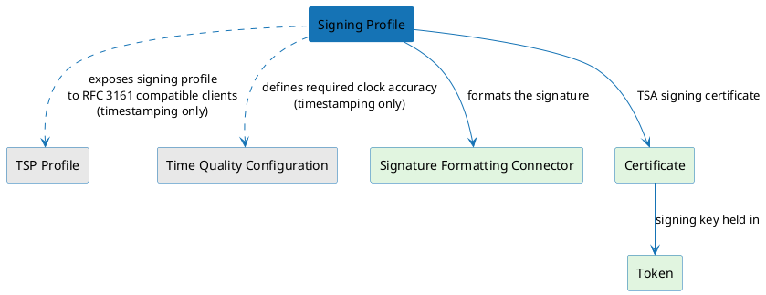

# Signing Profile

A Signing Profile is the central configuration object for a signing operation in the platform. It declares **what** is being signed (the workflow) and **how** the signing key is used (the scheme). It also binds the `TSP Profile` that accepts inbound timestamp requests, the `Time Quality Configuration` that governs time-source evaluation, and the signing records to retain.

---

## Relationships

The diagram below shows what a Signing Profile references and why.

---

## Configuration

A Signing Profile is configured across several tabs. The tabs shown depend on the selected workflow.

### General

| Field | Required | Description                                                                                                                                                                    |
|---|---|--------------------------------------------------------------------------------------------------------------------------------------------------------------------------------|
| **Name** | Yes | Unique identifier for the profile. Appears in the profile list and is used as part of the signing URL.                                                                         |
| **Description** | No | Free-text description of the profile.                                                                                                                                          |
| **Signing Workflow Type** | Yes | The type of signing operation this profile performs. Currently, Timestamping is the only available workflow. The selected workflow determines which additional tabs are shown. |

### Signing Scheme

| Field | Required | Description |
|---|---|---|
| **Signing Scheme** | Yes | The scheme that determines how the signing key is held and used. Currently only Managed is available. |
| **Managed Signing Scheme Type** | Yes | The type of managed signing scheme. Currently only Static Key is available — the same long-lived key is reused for every signing operation. |
| **Certificate** | Yes | The certificate linked to the key used to produce the signature. The list is filtered based on the current profile settings — only certificates that conform to the selected workflow are shown. For example, when Timestamping is selected, only certificates eligible for timestamping are listed — per RFC 3161, the extended key usage must contain only `id-kp-timeStamping` and the extension must be marked critical. |

#### Signing Operation Attributes

Configures the signature parameters required by the key associated with the selected certificate. The available fields are determined by the key type — for example, an RSA key exposes a signature scheme (PKCS#1 or PSS) and a digest algorithm, while other key types expose their own relevant parameters.

---

### Workflow Properties

The workflow properties tab contains options specific to the selected workflow. Refer to the documentation for your workflow:

- **Timestamping** — see [Timestamping Configuration](./timestamping/configuration.md)

### Record Policy

Configures whether signing records are created for this profile and what content is captured. Recording can be disabled entirely, or enabled with fine-grained control over which data payloads are stored. For details on the available settings — including content selection, retention period, and persistence mode — see [Signing Records](./signing-records.md).

### Custom Attributes

Displays [custom attributes](../certificate-key/settings/custom-attributes.md) that have been defined for the **Signing Profile** object. Custom attributes can be defined for different object types — only those scoped to Signing Profile appear here. Once defined, they appear on this tab and you can set values for them.

---

## Versioning

A Signing Profile is versioned. Each update is evaluated against two conditions — if either is met, a new version is created; otherwise the current version is updated in place:

1. [Signing records](./signing-records.md) already exist against the current version, or
2. The recording policy for signing records has changed.

The active version is always the most recent one.

---

## Deletion

A Signing Profile cannot be deleted while it is referenced by other objects or has signing records linked to it. To delete a Signing Profile you must first:

1. Remove all [signing records](./signing-records.md) linked to the profile.
2. Unlink the profile from all objects that reference it — for example, remove it as the default Signing Profile from any [TSP Profile](./timestamping/tsp-profile.md) that references it.

Once all references and records are cleared, the profile can be deleted.

---

## Related pages

- [TSP Profile](./timestamping/tsp-profile.md) — authentication methods and the default Signing Profile
- [Time Quality Configuration](./timestamping/time-quality-configuration.md) — time-source evaluation parameters
- [Signing records](./signing-records.md) — record structure and retention
- [Timestamping request flow](./timestamping/timestamping-flow.md) — how a profile is resolved and used per request
- [Limitations](./timestamping/limitations.md) — dependent-resource deletion behavior
