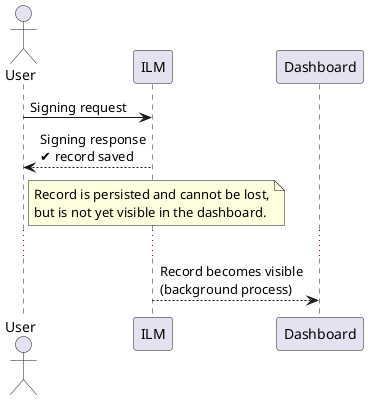
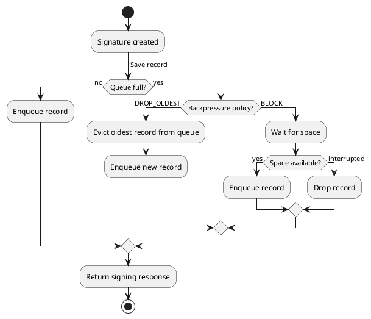

# Signing records

Every signing operation can produce a **signing record** — a persisted log entry that captures what was signed, when, by whom, and under which Signing Profile and version. Signing records are the basis for audit trails, compliance reporting, and record-retention obligations.

Whether a record is created, and what it contains, is controlled by the recording policy configured on the [Signing Profile](./signing-profile.md) — the settings are described below.

:::note[Policy fields are versioned]
Signing records are scoped to a specific `Signing Profile` version. This is why a new profile version is created whenever signing records exist against the current one — existing records must remain linked to the version under which they were created. As a consequence, changing any recording policy field — persistence mode, retention days, content toggles — applies only to future signing operations. Records already written are governed by the version active at signing time and are not affected retroactively.
:::

---

## What a signing record captures

A signing record always carries the following intrinsic fields:

| Field | Description |
|---|---|
| Signing profile UUID and version | Which profile (and which exact version) produced the record |
| Protocol | The signing protocol used |
| Signing time | When the signing operation was performed |
| Requested by | UUID and username of the authenticated principal |
| Display name | Human-readable label for the record |

In addition, the recording policy controls four optional payload fields:

| Toggle | Description |
|---|---|
| Request Metadata | Stores contextual information about the signing request. The exact fields depend on the signing workflow type. For example, the timestamping workflow records: the signing profile name and version, the serial number assigned to the timestamp, the hash algorithm, the policy OID, and the nonce. More fields may be added in future releases. |
| Signature | Stores the produced signature. |
| Signed Document | Stores the full signed document. |
| Data to Be Signed (DTBS) | Stores the raw data that was submitted for signing. |

When recording is enabled but no payload toggle is set, only the intrinsic fields are written.

---

## Recording policy settings

The recording policy is configured per Signing Profile version on the **Record Policy** tab.

### Recording enabled

The **Recording Enabled** toggle is the master switch. When off, no signing record is created for any operation under this profile version. Enabling it reveals the remaining settings.

### Captured content

The **Captured Content** section lets you configure which data is stored with each record. The available toggles depend on the type of signing workflow selected: **Request Metadata**, **Signature**, **Signed Document**, and **Data to Be Signed (DTBS)**. See [What a Signing Record Captures](#what-a-signing-record-captures) for descriptions of each field.

### Retention

**Retain Indefinitely** — when checked, records are kept until manually deleted. When unchecked, a **Retention Days** field appears where you specify how many days records are kept before they are automatically purged.

### Persistence mode

Controls the write guarantee for each record:

- **Immediate** — the record is written synchronously before the signing response is returned; highest durability, highest latency.
- **Deferred Durable** — the record is written asynchronously but guaranteed to be persisted; balanced latency and durability. This is the default.
- **Best Effort** — the record is written on a best-effort basis with no durability guarantee; lowest latency.

| Mode | Durability | Signing-path impact | When can a record be lost? |
|---|---|---|---|
| Immediate | Highest — committed with the signing operation or not written | Write latency added to signing path | Only if the database write itself fails. The signing response is still returned, but the failure is logged at error level in the server log. Under normal operation the risk is negligible. |
| Best Effort | None — in-memory only until flushed | No database I/O on signing path | Anytime: process crash, container restart, queue overflow, or a failed flush. There is no recovery — the record is gone. |
| Deferred Durable | High — durable on signing-transaction commit | Small outbox insert on signing path | Only if the outbox insert itself fails. The signing response is still returned, but the failure is logged at error level in the server log. Once the outbox row is committed, the record is safe — it survives a crash and is retried until it lands in the database. |

---

## How deferred-durable mode works

When a signing operation completes, the signing record is saved synchronously into the **outbox** — a dedicated intermediate storage area — before the response is returned to the caller. This means the record is guaranteed to be persisted and cannot be lost, even if the system restarts immediately after.

However, the record is not immediately visible in the signing records dashboard. A periodic background process called the **Outbox Drainer** gradually moves records from the outbox to their final destination, where they become visible to the user. This introduces a short delay between a signing operation completing and its record appearing in the dashboard.

### Poisoned records

In normal operation all records should drain successfully. However, in rare cases a record may fail to drain repeatedly — for example if data becomes corrupted or a referenced signing profile is deleted. To prevent a single problematic record from blocking all others, the Outbox Drainer tracks how many consecutive times it has failed to drain each record. Once that count reaches the poison threshold, the record is marked as poisoned and excluded from further drain attempts. Each poisoning event is logged at warn level in the server log. The reason for the last unsuccessful drain attempt is also stored alongside the record in the outbox, making it possible to investigate the root cause without trawling through logs.

The Outbox Drainer can be tuned by setting the corresponding environment variables or updating the application YAML under `signing-record.outbox`:

| YAML key | Environment variable | Default | Description |
|---|---|---|---|
| `flush-interval-ms` | `SIGNING_RECORD_OUTBOX_FLUSH_INTERVAL_MS` | `500` | How often the background process wakes up (ms). |
| `max-batch-size` | `SIGNING_RECORD_OUTBOX_MAX_BATCH_SIZE` | `200` | Max records moved per run. |
| `max-batches-per-run` | `SIGNING_RECORD_OUTBOX_MAX_BATCHES_PER_RUN` | `10` | Max batch iterations per wake-up. |
| `poison-threshold` | `SIGNING_RECORD_OUTBOX_POISON_THRESHOLD` | `10` | Number of consecutive failures before a record is marked as poisoned and skipped. |

---

## How best-effort mode works

When a signing operation completes, the signing record is placed into an **in-memory queue** and the signing response is returned immediately — no database write happens on the signing path. A background flusher periodically drains the queue and writes records to the database in batches.

:::warning[Best effort gives no durability guarantee]
Records held in the queue are lost on any process crash, container restart, or abrupt shutdown. Queue overflow also drops records silently. Do not use best-effort mode for `Signing Profiles` where records are legally or contractually required.
:::

### Queue capacity and overflow

The queue has a fixed capacity (default: 10 000 records). When the queue is full and a new record arrives, the oldest record in the queue is evicted to make room — the new record is always admitted, but the oldest pending one is silently dropped. This keeps the signing path from ever blocking, but means sustained overload will lose the oldest records first.

You can change this behaviour by switching the backpressure policy to `BLOCK`: the flusher must free up space before the enqueue returns. This adds backpressure to the signing path under load but reduces the number of dropped records. If the wait is interrupted, the record is dropped and counted as a failed intake.

The best-effort flusher can be tuned by setting the corresponding environment variables or updating the application YAML under `signing-record.best-effort`:

| YAML key | Environment variable | Default | Description |
|---|---|---|---|
| `queue-capacity` | `SIGNING_RECORD_BEST_EFFORT_QUEUE_CAPACITY` | `10000` | Maximum number of records the in-memory queue can hold before overflow handling kicks in. |
| `backpressure-policy` | `SIGNING_RECORD_BEST_EFFORT_BACKPRESSURE_POLICY` | `DROP_OLDEST` | What happens when the queue is full: `DROP_OLDEST` evicts the oldest queued record to admit the new one; `BLOCK` waits for free space (may slow the signing path). |
| `flush-interval-ms` | `SIGNING_RECORD_BEST_EFFORT_FLUSH_INTERVAL_MS` | `200` | How often the background flusher wakes up (ms). |
| `max-batch-size` | `SIGNING_RECORD_BEST_EFFORT_MAX_BATCH_SIZE` | `200` | Maximum number of records written to the database per flush. |

Raise `queue-capacity` for bursty high-throughput profiles to absorb spikes without dropping records. Lower `flush-interval-ms` to reduce the window between a record entering the queue and landing in the database.

---

## Retention

A background retention sweep periodically deletes signing records that have exceeded their configured retention period. Each sweep run processes records in batches — a set number of records per batch, up to a set number of batches per run — so a large backlog is worked through gradually rather than in a single long-running operation. In a clustered ILM deployment, the sweep always runs on exactly one node and never concurrently.

Records set to retain indefinitely are untouched by the sweep and can only be removed manually.

The sweep can be tuned by setting the corresponding environment variables or updating the application YAML under `signing-record.retention`. Administrators should configure these values so that the sweep keeps up with the volume of records expiring in the system:

| YAML key | Environment variable | Default | Description |
|---|---|---|---|
| `sweep-interval-minutes` | `SIGNING_RECORD_RETENTION_SWEEP_INTERVAL_MINUTES` | `60` | How often the sweeper runs (minutes). Min: 1. |
| `batch-size` | `SIGNING_RECORD_RETENTION_BATCH_SIZE` | `1000` | Records deleted per database batch. Min: 1. |
| `max-batches-per-sweep` | `SIGNING_RECORD_RETENTION_MAX_BATCHES_PER_SWEEP` | `10` | Max batches per sweep run. Set to `0` to disable the sweep entirely. |

The maximum number of records deleted per sweep run equals `batch-size × max-batches-per-sweep` (default: 10 000 per hour).

---

## Metrics and monitoring

ILM exposes a set of metrics that let you verify signing records are flowing through the system without bottlenecks, and investigate when something goes wrong. The metrics follow a funnel: each record enters at intake, is persisted, and eventually deleted. A healthy system shows intake counts flowing into persist counts with no growing gap between them.

### Intake metrics

Intake counts every signing operation that reached the recording subsystem. From there it branches into one of three outcomes: skipped (recording disabled on the `Signing Profile`), failed, or successfully accepted. What "failed" and "successfully accepted" mean depends on the persistence mode:

- **Immediate** — success means the record was saved to its final destination and is immediately visible; failure means saving failed.
- **Deferred Durable** — success means the record was staged in the outbox and is guaranteed to reach its final destination; failure means staging failed.
- **Best Effort** — success means the record was accepted into the processing queue; failure means it could not be queued (for example, an interrupted `BLOCK` wait).

| Metric | Description |
|---|---|
| `signing_record.intake{mode}` | Number of records accepted for processing, labelled by persistence mode. |
| `signing_record.intake.skipped` | Operations where recording was disabled on the `Signing Profile` — no record was produced. |
| `signing_record.intake.failed{mode, reason}` | Records that failed at intake before reaching persistence — for example an interrupted queue enqueue in `BEST_EFFORT` mode. |

`intake{mode}` = `intake.skipped` + `intake.failed{mode}` + `success{mode}`

`success{mode}` = `intake{mode}` - `intake.skipped` - `intake.failed{mode}`

### Persist metrics

Persist counts records that have been saved to their final destination and are visible to the user. For `Immediate` mode this equals intake — the record is written in the same step. For `Deferred Durable` and `Best Effort` these numbers will differ: records are first accepted at intake and only land in the final destination later, via the outbox drainer or the best-effort flusher respectively.

| Metric | Description |
|---|---|
| `signing_record.persist{mode}` | Records saved to their final destination and visible to the user, labelled by persistence mode. |
| `signing_record.persist.failed` | Records that failed to be persisted to their final destination. |
| `signing_record.best_effort.evicted` | Records evicted from the best-effort queue because it was full (`DROP_OLDEST` policy). A rising value means the queue is consistently overloaded. |
| `signing_record.write.duration{mode}` | Time spent writing a record, labelled by persistence mode. Useful for spotting database latency affecting the signing path. |

`persist.success{mode}` = `persist{mode}` - `persist.failed`

### Deletion metrics

| Metric | Description |
|---|---|
| `signing_record.deleted` | Records deleted by the retention sweep. |
| `signing_record.sweep` | Total number of retention sweep runs. |
| `signing_record.sweep.failed` | Retention sweep runs that failed. |
| `signing_record.delete.failed` | Individual delete operations that failed within a sweep. |

`sweep.success` = `sweep` - `sweep.failed`

### Outbox gauges

The following gauges apply to `Deferred Durable` mode and give a real-time view of the outbox backlog:

| Metric | Description |
|---|---|
| `signing_record.outbox.depth` | Number of outbox rows waiting to be drained into the database. A steadily rising value means the drainer is falling behind. |
| `signing_record.outbox.lag_seconds` | Age of the oldest undrained outbox row in seconds. Rising lag is the clearest early signal of a backlog building up. |
| `signing_record.outbox.poisoned` | Rows that have exceeded the poison threshold and will no longer be retried. Any non-zero value means records have been permanently abandoned and requires investigation — check the outbox table's `lastError` column for the cause. |
