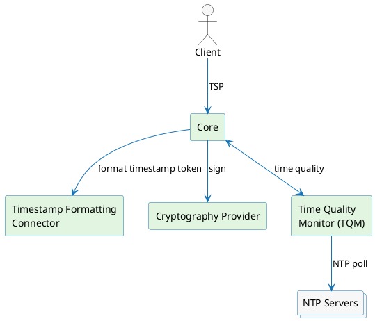

# Timestamping overview

Timestamping builds on the same infrastructure as general signing. It adds clock-accuracy enforcement and an RFC 3161 endpoint for requesting timestamp tokens.

If you are new to signing in the platform, read [Concepts](/docs/signing/concepts) first, then return here to understand what timestamping adds on top.

---

## What makes timestamping different

### Time quality enforcement

In other signing workflows the accuracy of the platform's system clock affects only audit log timestamps, not the validity of the signature itself. Timestamping is different: the binding between a document hash and a point in time is the entire purpose of a timestamp token, so the issuing clock must demonstrably be within a known accuracy bound.

The platform can enforce [time quality requirements](./time-quality-configuration.md) before issuing a token. When this enforcement is configured, the platform evaluates the current clock accuracy against those requirements and rejects the request when they are not met. Without configured time quality requirements, the platform issues tokens without this additional check.

### TSP protocol exposure

In the general signing flow clients call the platform API directly. Timestamping additionally supports the **Time-Stamp Protocol (TSP)** defined in RFC 3161. This allows standard TSA clients — PDF signing libraries, document management systems, and archival tools — to request timestamps without any the platform-specific integration.

The TSP protocol is configured through a [TSP Profile](./tsp-profile.md), which can be linked to a `Signing Profile` to expose the RFC 3161 protocol. The OpenAPI specification of the endpoint can be found in [Protocol API - TSP](/api/protocol-tsp/).

---

## Components

Here is a recap of the components involved in a timestamping operation and their responsibilities.

| Component | Responsibility |
|---|---|
| **Core** | Receives the request, coordinates with all other components, and returns the signed token. |
| **Cryptography Provider** | Holds and operates the TSA private key. |
| **Timestamp Formatting Connector** | Assembles the data structure to be signed. See [Timestamp Formatting Connector](./timestamp-formatting-connector.md). |
| **Time Quality Monitor (TQM)** | Continuously polls NTP servers and reports clock accuracy to the platform. |

For a detailed end-to-end walkthrough, see [Timestamping request flow](./timestamping-flow.md).

---

## Configuring timestamping

To issue timestamps, configure a [Signing Profile](/docs/signing/signing-profile) with the **Timestamping** workflow selected. The workflow unlocks a set of timestamping-specific fields on the profile — see [Configuration](./configuration.md) for the full reference.

### TSP Profile

A `TSP Profile` can be linked to the `Signing Profile` to expose the RFC 3161 protocol. See [TSP Profile](./tsp-profile.md).

### Time Quality Configuration

A `Time Quality Configuration` can be linked to the `Signing Profile` to enforce clock accuracy before issuing a token. See [Time Quality Configuration](./time-quality-configuration.md).
