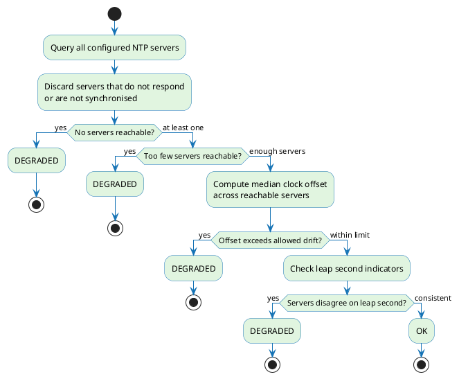

# Time quality evaluation

The Time Quality Monitor (TQM) evaluates whether the system clock meets the accuracy requirements for issuing RFC 3161 timestamp tokens. ILM provides the active `Time Quality Configurations` to TQM, which evaluates the configured NTP sources and reports an **OK** or **DEGRADED** result to ILM.

ILM uses the result to determine whether a `Signing Profile` associated with a `Time Quality Configuration` can issue timestamp tokens. To define the evaluation requirements, see [Time Quality Configuration](./time-quality-configuration.md).

---

## NTP evaluation

TQM runs an independent check cycle for each [Time Quality Configuration](./time-quality-configuration.md) active in ILM. Within each cycle it evaluates the NTP servers defined in that configuration in four steps:

1. **Server reachability** — TQM contacts every NTP server in parallel. Any server that does not respond or reports that its own clock is unsynchronised is excluded from further evaluation.

2. **Minimum server count** — If too few servers remain after exclusion, the result is DEGRADED. The required minimum is set in the [Time Quality Configuration](./time-quality-configuration.md).

3. **Clock drift** — TQM computes the median offset of the reachable servers against the local clock. If it exceeds the configured limit, the result is DEGRADED.

4. **Leap second consistency** — If the reachable servers disagree about an upcoming leap second, the result is DEGRADED.

All four checks must pass for the result to be **OK**. The first failure determines the reason reported to ILM.

---

## How the result affects timestamping

ILM applies the latest time quality result to each `Signing Profile` associated with the evaluated `Time Quality Configuration`:

- When the result is **OK**, timestamp issuance proceeds normally.
- When the result is **DEGRADED**, the profile does not issue timestamp tokens.
- When no `Time Quality Configuration` is associated with the profile, time quality enforcement is not applied.

## Related pages

- [Time Quality Configuration](./time-quality-configuration.md) — define NTP sources and evaluation requirements
- [Troubleshooting](./troubleshooting.md) — diagnose timestamp requests rejected because time is unavailable
- [Time Quality Monitor repository](https://github.com/OmniTrustILM/time-quality-monitor) — deployment, health checks, messaging, and environment configuration
