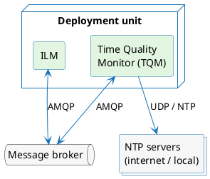
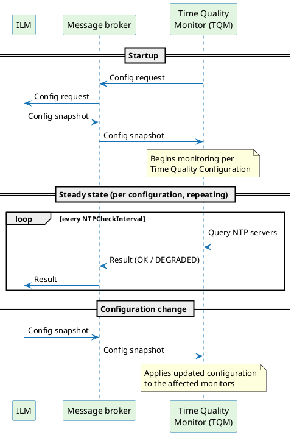
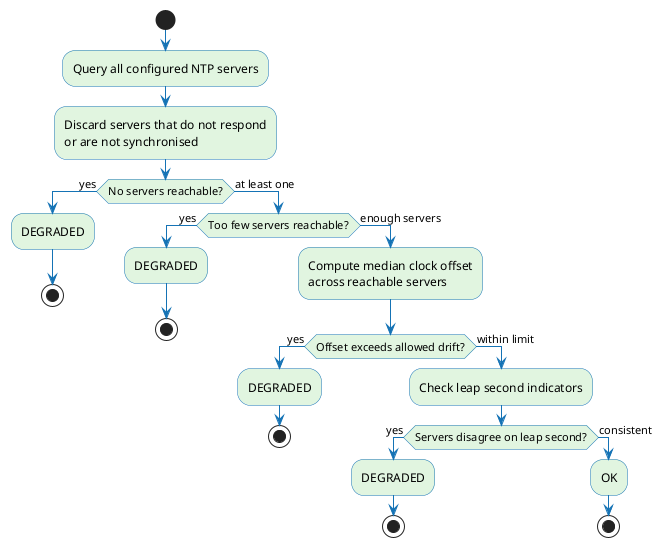

# Time Quality Monitor

The Time Quality Monitor (TQM) continuously evaluates whether the system clock meets the accuracy requirements for issuing RFC 3161 timestamp tokens. It queries the configured NTP servers on behalf of each Time Quality Configuration, applies the configured thresholds, and reports the outcome — **OK** or **DEGRADED** — back to ILM. This is how ILM satisfies the time-source accuracy requirements of ETSI EN 319 421 and eIDAS Art. 42(1)(b) for qualified time stamps.

To configure time quality evaluation requirements, see [Time Quality Configuration](./time-quality-configuration.md). To provision the broker and set TQM's environment variables, see [Time Quality Monitor configuration](./time-quality-monitor-configuration.md).

---

## Deploying the Time Quality Monitor

TQM runs as a separate container or process that must be co-located with ILM:

- **Kubernetes** — deploy TQM as an additional container in the same pod as ILM.
- **Virtual machine** — run TQM as a process or container on the same machine as ILM.

TQM and ILM do not connect to each other directly. All communication goes through a message broker (RabbitMQ or Azure Service Bus) using the AMQP 1.0 protocol, so neither component has a hard runtime dependency on the other. See [Message flows](#message-flows) for the communication protocol and [Broker configuration](./time-quality-monitor-configuration.md#broker-configuration) for broker-specific setup.



### Health endpoint

TQM exposes a single HTTP endpoint for container health checks:

```
GET /health
```

The endpoint listens on `LISTEN_PORT` (default `8080`) and returns HTTP `200` when TQM is running and connected to the message broker, or a non-2xx status when the broker connection is unavailable. Use it for both liveness and readiness probes in your container orchestration platform.

---

## Message flows

TQM and ILM exchange messages through three flows carried over a single shared exchange or topic. The table below describes each flow; for the broker constructs that implement them, see [Broker configuration](./time-quality-monitor-configuration.md#broker-configuration).

| Flow | Direction | Purpose |
|---|---|---|
| Config request | TQM → ILM | TQM requests a snapshot of all active `Time Quality Configurations`. Re-sent at `BROKER_REQUEST_TIMEOUT` intervals until a snapshot arrives. |
| Config snapshot | ILM → TQM | ILM delivers the full set of active `Time Quality Configurations`. TQM begins monitoring each configuration on receipt. |
| Results | TQM → ILM | TQM publishes the outcome (**OK** / **DEGRADED**) of each NTP check cycle, per configuration. |

The sequence below shows how these flows are exchanged at startup and during steady-state operation:



On startup, TQM opens a receiver for the config-snapshot flow and immediately publishes a config request. ILM responds with a snapshot of all active `Time Quality Configurations`. If no snapshot arrives, TQM re-publishes the config request at `BROKER_REQUEST_TIMEOUT` intervals. Once a snapshot is received, TQM begins monitoring each configuration and publishing results. When a `Time Quality Configuration` is created, updated, or removed in ILM, ILM pushes a new config snapshot without waiting for a request — TQM applies it immediately.

---

## NTP evaluation

TQM runs an independent check cycle for each [Time Quality Configuration](./time-quality-configuration.md) active in ILM. Within each cycle it evaluates the NTP servers defined in that configuration in four steps:

1. **Server reachability** — TQM contacts every NTP server in parallel. Any server that does not respond or reports that its own clock is unsynchronised is excluded from further evaluation.

2. **Minimum server count** — If too few servers remain after exclusion, the result is DEGRADED. The required minimum is set in the [Time Quality Configuration](./time-quality-configuration.md).

3. **Clock drift** — TQM computes the median offset of the reachable servers against the local clock. If it exceeds the configured limit, the result is DEGRADED.

4. **Leap second consistency** — If the reachable servers disagree about an upcoming leap second, the result is DEGRADED.

All four checks must pass for the result to be **OK**. The first failure determines the reason reported to ILM.



---

## Configuration and deployment

TQM is configured entirely through environment variables, and the message broker must be provisioned with the exchange or topic and the queues that the [message flows](#message-flows) use. Both are covered on the [Time Quality Monitor configuration](./time-quality-monitor-configuration.md) page.
