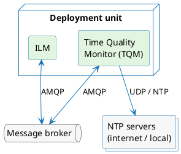
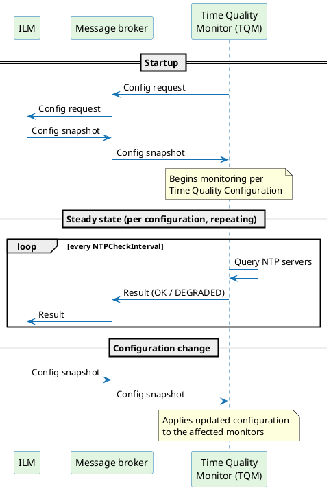
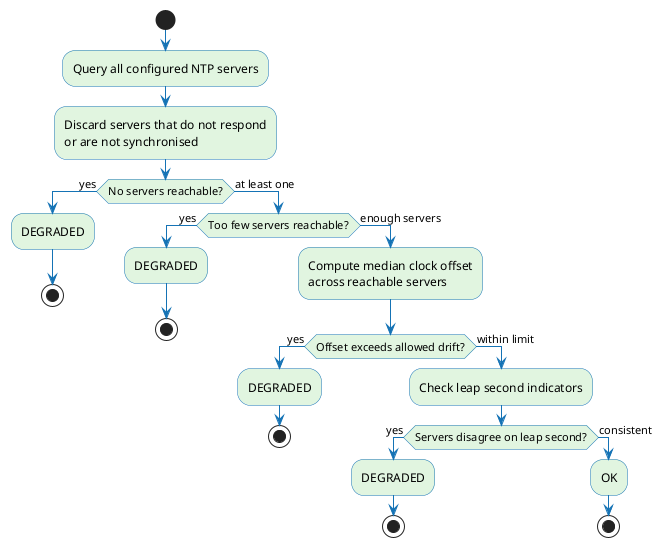

# Time Quality Monitor

The Time Quality Monitor (TQM) continuously evaluates whether the system clock meets the accuracy requirements for issuing RFC 3161 timestamp tokens. It queries the configured NTP servers on behalf of each Time Quality Configuration, applies the configured thresholds, and reports the outcome — **OK** or **DEGRADED** — back to ILM. This is how ILM satisfies the time-source accuracy requirements of ETSI EN 319 421 and eIDAS Art. 42(1)(b) for qualified time stamps.

To configure time quality evaluation requirements, see [Time Quality Configuration](./time-quality-configuration.md). To configure the connection to the Time Quality Monitor, see [Time Quality Monitor configuration](#time-quality-monitor-configuration).

---

## Deploying the Time Quality Monitor

TQM runs as a separate container or process that must be co-located with ILM:

- **Kubernetes** — deploy TQM as an additional container in the same pod as ILM.
- **Virtual machine** — run TQM as a process or container on the same machine as ILM.

TQM and ILM do not connect to each other directly. All communication goes through a message broker (RabbitMQ or Azure Service Bus) using the AMQP 1.0 protocol, so neither component has a hard runtime dependency on the other. See [Message flows](#message-flows) for the communication protocol and [Broker configuration](#broker-configuration) for broker-specific setup.



### Health endpoint

TQM exposes a single HTTP endpoint for container health checks:

```
GET /health
```

The endpoint listens on `LISTEN_PORT` (default `8080`) and returns HTTP `200` when TQM is running and connected to the message broker, or a non-2xx status when the broker connection is unavailable. Use it for both liveness and readiness probes in your container orchestration platform.

---

## Message flows

TQM and ILM exchange messages through three flows carried over a single shared exchange or topic. The table below describes each flow; for the broker constructs that implement them, see [Broker configuration](#broker-configuration).

| Flow | Direction | Purpose |
|---|---|---|
| Config request | TQM → ILM | TQM requests a snapshot of all active `Time Quality Configurations`. Re-sent at `BROKER_REQUEST_TIMEOUT` intervals until a snapshot arrives. |
| Config snapshot | ILM → TQM | ILM delivers the full set of active `Time Quality Configurations`. TQM begins monitoring each configuration on receipt. |
| Results | TQM → ILM | TQM publishes the outcome (**OK** / **DEGRADED**) of each NTP check cycle, per configuration. |

The sequence below shows how these flows are exchanged at startup and during steady-state operation:



On startup, TQM opens a receiver for the config-snapshot flow and immediately publishes a config request. ILM responds with a snapshot of all active `Time Quality Configurations`. If no snapshot arrives, TQM re-publishes the config request at `BROKER_REQUEST_TIMEOUT` intervals. Once a snapshot is received, TQM begins monitoring each configuration and publishing results. When a `Time Quality Configuration` is created, updated, or removed in ILM, ILM pushes a new config snapshot without waiting for a request — TQM applies it immediately.

---

## Broker configuration

This section describes what must be configured on the broker side for ILM and TQM to exchange the [message flows](#message-flows) described above. Both RabbitMQ and Azure Service Bus are supported; because the two brokers use different terminology for the same concepts, the required constructs are described separately for each to avoid confusion.

### RabbitMQ topology

The three [message flows](#message-flows) share one exchange. Each flow has a dedicated queue bound to that exchange with a binding key matching the routing key the publisher uses for that flow.

In a standard Helm-based deployment the `provisioning-rabbitmq` service creates all of the following automatically. For a self-managed broker, provision them manually before starting either component.

**1. Exchange**

Create one exchange. Neither ILM nor TQM declares it at runtime — it must already exist.

| Property | Default | Override |
|---|---|---|
| Exchange name | `ilm` | `BROKER_EXCHANGE` |

**2. Queue: Config request**

A queue bound to the exchange. TQM uses the binding key to publish; ILM uses the queue name to consume. Configure with `x-max-length: 1` and `x-overflow: drop-head` — the queue holds only the latest request; older messages are silently discarded.

| Property | Default | Override |
|---|---|---|
| Queue name | `time-quality.config-request` | `BROKER_QUEUE_TIME_QUALITY_CONFIG_REQUEST` (ILM) |
| Binding key | `time-quality.config-request` | `BROKER_ROUTINGKEY_TIME_QUALITY_CONFIG_REQUEST` (ILM, TQM) |

**3. Queue: Config snapshot**

A queue bound to the exchange. ILM uses the binding key to publish; TQM uses the queue name to consume. Configure with `x-max-length: 1` and `x-overflow: drop-head` — the queue holds only the latest full snapshot; older snapshots are silently discarded.

| Property | Default | Override |
|---|---|---|
| Queue name | `time-quality.config` | `BROKER_QUEUE_TIME_QUALITY_CONFIG` (ILM, TQM) |
| Binding key | `time-quality.config` | `BROKER_ROUTINGKEY_TIME_QUALITY_CONFIG` (ILM, TQM) |

**4. Queue: Results**

A queue bound to the exchange. TQM uses the binding key to publish; ILM uses the queue name to consume. This is an unbounded work queue — no depth limit applies.

| Property | Default | Override |
|---|---|---|
| Queue name | `time-quality.results` | `BROKER_QUEUE_TIME_QUALITY_RESULTS` (ILM) |
| Binding key | `time-quality.results` | `BROKER_ROUTINGKEY_TIME_QUALITY_RESULTS` (ILM, TQM) |

**Broker permissions**

The TQM user requires **write** rights on the exchange (used for both `config-request` and `results` flows) and **read** rights on the `time-quality.config` queue. The TQM must not declare or modify exchanges, queues, or bindings — topology is provisioned by the platform (the Helm chart).

### Azure Service Bus topology

The three [message flows](#message-flows) share one topic. Each flow has a dedicated subscription on that topic; the Correlation Filter on each subscription must match the subject the publisher sets on its messages.

All constructs must be provisioned manually in Azure Service Bus before starting either component. No automatic provisioning is performed by the Helm charts.

**1. Topic**

Create one topic. Neither ILM nor TQM declares it at runtime — it must already exist.

| Property | Default | Override |
|---|---|---|
| Name | `ilm` | `BROKER_EXCHANGE` |

**2. Subscription: Config request**

A subscription on the topic with a Correlation Filter on `Properties.Subject`. TQM sets the subject when publishing; ILM uses the subscription name to consume.

| Property | Default | Override |
|---|---|---|
| Subscription name | `time-quality.config-request` | `BROKER_QUEUE_TIME_QUALITY_CONFIG_REQUEST` (ILM) |
| Correlation filter | `time-quality.config-request` | `BROKER_ROUTINGKEY_TIME_QUALITY_CONFIG_REQUEST` (ILM, TQM) |

**3. Subscription: Config snapshot**

A subscription on the topic with a Correlation Filter on `Properties.Subject`. ILM sets the subject when publishing; TQM uses the subscription name to consume.

| Property | Default | Override |
|---|---|---|
| Subscription name | `time-quality.config` | `BROKER_QUEUE_TIME_QUALITY_CONFIG` (ILM, TQM) |
| Correlation filter | `time-quality.config` | `BROKER_ROUTINGKEY_TIME_QUALITY_CONFIG` (ILM, TQM) |

**4. Subscription: Results**

A subscription on the topic with a Correlation Filter on `Properties.Subject`. TQM sets the subject when publishing; ILM uses the subscription name to consume.

| Property | Default | Override |
|---|---|---|
| Subscription name | `time-quality.results` | `BROKER_QUEUE_TIME_QUALITY_RESULTS` (ILM) |
| Correlation filter | `time-quality.results` | `BROKER_ROUTINGKEY_TIME_QUALITY_RESULTS` (ILM, TQM) |

---

## NTP evaluation

TQM runs an independent check cycle for each [Time Quality Configuration](./time-quality-configuration.md) active in ILM. Within each cycle it evaluates the NTP servers defined in that configuration in four steps:

1. **Server reachability** — TQM contacts every NTP server in parallel. Any server that does not respond or reports that its own clock is unsynchronised is excluded from further evaluation.

2. **Minimum server count** — If too few servers remain after exclusion, the result is DEGRADED. The required minimum is set in the [Time Quality Configuration](./time-quality-configuration.md).

3. **Clock drift** — TQM computes the median offset of the reachable servers against the local clock. If it exceeds the configured limit, the result is DEGRADED.

4. **Leap second consistency** — If the reachable servers disagree about an upcoming leap second, the result is DEGRADED.

All four checks must pass for the result to be **OK**. The first failure determines the reason reported to ILM.



---

## Time Quality Monitor configuration

All TQM configuration is supplied through environment variables and covers operational concerns such as the broker connection. The parameters that govern time quality monitoring itself — NTP servers, thresholds, and evaluation rules — are not configured here; they are delivered from ILM at runtime as part of the `Time Quality Configuration`. See [Time Quality Configuration](./time-quality-configuration.md).

### Health endpoint

| Variable | Default | Description |
|---|---|---|
| `LISTEN_PORT` | `8080` | Port TQM listens on for the `GET /health` endpoint. Used by container liveness and readiness probes. |

### Broker selection

Select the broker type by setting `BROKER_TYPE`:

| `BROKER_TYPE` | Broker |
|---|---|
| `RABBITMQ` (default) | RabbitMQ |
| `SERVICEBUS` | Azure Service Bus |

### Broker connection

#### RabbitMQ

TQM connects to RabbitMQ over AMQP 1.0 using SASL PLAIN authentication. You can specify the broker address either as a full URL via `BROKER_URL`, or by setting `BROKER_HOST` and `BROKER_PORT` separately — `BROKER_URL` takes precedence when both are provided. The virtual host is passed in the AMQP Open frame hostname as `vhost:<BROKER_VIRTUAL_HOST>`.

TLS is disabled by default. Enable it with `BROKER_TLS_ENABLED`, or use an `amqps://` URL — both switch the connection scheme to `amqps://`. When TLS is active, TQM loads a PKCS12 keystore for mutual TLS authentication and an optional PKCS12 truststore for verifying the broker's certificate.

| Variable | Default | Description |
|---|---|---|
| `BROKER_URL` | — | Full AMQP(S) connection URL. When set, overrides `BROKER_HOST` and `BROKER_PORT`. |
| `BROKER_HOST` | — | RabbitMQ hostname. Used only when `BROKER_URL` is not set. |
| `BROKER_PORT` | — | RabbitMQ port. Used only when `BROKER_URL` is not set. |
| `BROKER_VIRTUAL_HOST` | — | RabbitMQ virtual host. Transmitted in the AMQP Open frame hostname as `vhost:<value>`. |
| `BROKER_USERNAME` | — | SASL PLAIN username. |
| `BROKER_PASSWORD` | — | SASL PLAIN password. |
| `BROKER_TLS_ENABLED` | `false` | Enables TLS. When true, the connection scheme becomes `amqps://`. Implied by the `amqps://` scheme in `BROKER_URL`. |
| `BROKER_TLS_KEYSTORE` | — | Path to a PKCS12 keystore file for mutual TLS with the broker. |
| `BROKER_TLS_KEYSTORE_PASSWORD` | — | Password for `BROKER_TLS_KEYSTORE`. |
| `BROKER_TLS_TRUSTSTORE` | — | Path to a PKCS12 truststore file for broker CA verification. Optional. |
| `BROKER_TLS_TRUSTSTORE_PASSWORD` | — | Password for `BROKER_TLS_TRUSTSTORE`. |

#### Azure Service Bus

TQM connects to Azure Service Bus over AMQP 1.0 with TLS always active. Set `BROKER_URL` to the Service Bus namespace endpoint — the `amqps://` scheme is required and implies TLS.

| Variable | Default | Description |
|---|---|---|
| `BROKER_URL` | — | Service Bus namespace URL. Required. Format: `amqps://<namespace>.servicebus.windows.net`. |

Two authentication modes are supported — configure one or the other, not both:

##### SAS authentication

TQM authenticates using SASL PLAIN, sending the SAS policy name and token as credentials.

| Variable | Default | Description |
|---|---|---|
| `BROKER_USERNAME` | — | SAS policy name. |
| `BROKER_PASSWORD` | — | SAS token. |

##### Entra ID authentication

TQM authenticates using SASL ANONYMOUS and completes a CBS (Claim-Based Security) token exchange immediately after the connection opens. An OAuth2 token is obtained from Entra ID using the configured client credentials and sent to the broker to authorize the session.

| Variable | Default | Description |
|---|---|---|
| `BROKER_AZURE_TENANT_ID` | — | Entra ID tenant ID. |
| `BROKER_AZURE_CLIENT_ID` | — | Entra ID application (client) ID. |
| `BROKER_AZURE_CLIENT_SECRET` | — | Entra ID client secret. |

### Reconnection

TQM manages the AMQP connection lifecycle internally. On any connection or link error it closes the existing connection, waits through the configured backoff sequence, and redials. The receiver and sender are rebuilt on each reconnect. After all backoff entries are exhausted TQM logs an error and continues waiting — it does not exit.

| Variable | Default | Description |
|---|---|---|
| `BACKOFF` | `PT100MS` | Comma-separated ISO 8601 durations defining the reconnection backoff schedule. Recommended: `PT100MS, PT200MS, PT500MS, PT1S, PT2S, PT5S, PT10S`. |

### Message routing

These variables control the exchange or topic name and the routing keys and queue names used for each message flow. The values must match the constructs provisioned on the broker — see [Broker configuration](#broker-configuration).

| Variable | Default | Description |
|---|---|---|
| `BROKER_EXCHANGE` | `ilm` | Name of the RabbitMQ exchange or Azure Service Bus topic shared by all three message flows. Must match the value configured in ILM. |
| `BROKER_ROUTINGKEY_TIME_QUALITY_CONFIG_REQUEST` | `time-quality.config-request` | Routing key (RabbitMQ) or subject (Service Bus) TQM uses when publishing config requests. |
| `BROKER_ROUTINGKEY_TIME_QUALITY_CONFIG` | `time-quality.config` | Binding key (RabbitMQ) or Correlation Filter value (Service Bus) for the config-snapshot queue or subscription. Must match the value configured in ILM. |
| `BROKER_ROUTINGKEY_TIME_QUALITY_RESULTS` | `time-quality.results` | Routing key (RabbitMQ) or subject (Service Bus) TQM uses when publishing NTP check results. |
| `BROKER_QUEUE_TIME_QUALITY_CONFIG` | `time-quality.config` | Name of the queue (RabbitMQ) or subscription (Service Bus) from which TQM consumes config snapshots. |
| `BROKER_REQUEST_TIMEOUT` | — | How long TQM waits for a config snapshot before re-sending the config request. ISO 8601 duration (e.g. `PT5S`). |

---

## ILM configuration

ILM must be configured to connect to the same broker and use matching routing keys and queue names so that messages are correctly exchanged with TQM. ILM's general broker connection settings are covered in the ILM configuration documentation. The variables listed here are specific to the time quality messaging integration.

All variables use the same naming convention as TQM — where both sides share a variable, the default values match, and both must be set to the same value if overridden.

### Message routing

| Variable | Default | Description |
|---|---|---|
| `BROKER_EXCHANGE` | `ilm` | Name of the RabbitMQ exchange or Azure Service Bus topic shared by all three message flows. Must match the value configured in TQM. |
| `BROKER_ROUTINGKEY_TIME_QUALITY_CONFIG_REQUEST` | `time-quality.config-request` | Routing key (RabbitMQ) or subject (Service Bus) ILM expects on incoming config requests from TQM. Must match the value configured in TQM. |
| `BROKER_ROUTINGKEY_TIME_QUALITY_CONFIG` | `time-quality.config` | Routing key (RabbitMQ) or subject (Service Bus) ILM uses when publishing config snapshots to TQM. Must match the value configured in TQM. |
| `BROKER_ROUTINGKEY_TIME_QUALITY_RESULTS` | `time-quality.results` | Routing key (RabbitMQ) or subject (Service Bus) ILM expects on incoming results from TQM. Must match the value configured in TQM. |
| `BROKER_QUEUE_TIME_QUALITY_CONFIG_REQUEST` | `time-quality.config-request` | Name of the queue (RabbitMQ) or subscription (Service Bus) from which ILM consumes config requests sent by TQM. |
| `BROKER_QUEUE_TIME_QUALITY_CONFIG` | `time-quality.config` | Name of the queue (RabbitMQ) or subscription (Service Bus) ILM publishes config snapshots to. Must match `BROKER_QUEUE_TIME_QUALITY_CONFIG` on the TQM side. |
| `BROKER_QUEUE_TIME_QUALITY_RESULTS` | `time-quality.results` | Name of the queue (RabbitMQ) or subscription (Service Bus) from which ILM consumes NTP check results published by TQM. |
