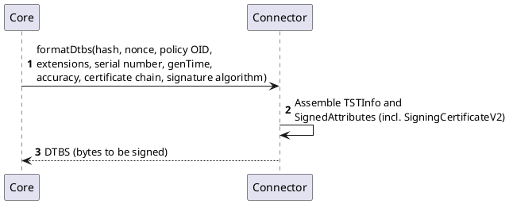
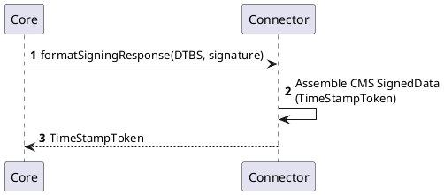

# Timestamp Formatting Connector

The Timestamp Formatting Connector is the RFC 3161 implementation of the [Signature Formatting Provider](../../certificate-key/connectors/provider-interfaces/signature-formatting-provider.md) interface for Time-Stamp Tokens. It is a stateless HTTP service that handles all ASN.1 construction work required to produce a verifiable `TimeStampToken` in the managed static-key signing flow.

## Overview

The connector is responsible for formatting the data to be signed, then assembling the final `TimeStampToken` once `ILM Core` has signed it. It holds no keys and performs no cryptographic signing itself — that stays with `ILM Core` and the profile's managed key.

For the architecture context, including where the Timestamp Formatting Connector fits among `ILM Core`, TQM, and the cryptographic token, see [Timestamping overview](./overview.md).

## How it works

When `ILM Core` issues a timestamp token for a managed static-key `Signing Profile`, it calls the Timestamp Formatting Connector at two points in the flow (see [Timestamping request flow](./timestamping-flow.md) for the full sequence):

1. **`formatDtbs`** — build the DER structures to be signed, given the hash, nonce, policy identifier, extensions, serial number, timestamp, accuracy, certificate chain, and signature algorithm gathered by `ILM Core`.
2. **`formatSigningResponse`** — after `ILM Core` has signed the DTBS with the profile's static key, assemble those signed bytes into the final, standards-compliant `TimeStampToken`.

Each call is independent — the connector receives everything it needs as request input and returns the result of that single step, with nothing carried over from the other call.

## Configuration

The Timestamp Formatting Connector is configured through environment variables.

| Variable | Default | Description |
|---|---|---|
| `PORT` | `8080` | HTTP server port the connector listens on. |

## Attributes

The connector exposes a set of configurable attributes that control optional content added to the assembled `TimeStampToken`. These are set when configuring the connector on the `Signing Profile` and validated through the connector's [Attributes interface](../../certificate-key/connectors/common-interfaces/attributes-interface.md); an unrecognized attribute name is rejected.

| Attribute key | Label | Type | Required | Default | Effect |
|---|---|---|---|---|---|
| `includeTsaName` | Include TSA Name | Boolean | No | `true` | Includes the TSA's distinguished name in the `tsaName` field of `TSTInfo`. |
| `includeCMSAlgorithmProtection` | Include CMS Algorithm Protection | Boolean | No | `true` | Adds the `id-aa-CMSAlgorithmProtection` signed attribute (RFC 6211), binding the digest and signature algorithms to prevent algorithm-substitution attacks. |
| `includeSigningTimeAttribute` | Include Signing Time Attribute | Boolean | No | `true` | Adds the `signingTime` CMS signed attribute. |

When an attribute is omitted from the connector configuration, the connector falls back to the default shown above.

:::note
Values that vary per timestamp token — for example the qualified status, accuracy, policy identifier, serial number, and nonce — are not connector attributes. They are supplied per call in the `formatDtbs`/`formatSigningResponse` request payload, not configured on the connector.
:::

## Provider objects

The Timestamp Formatting Connector is referenced by a [`Signing Profile`](../signing-profile.md) as its **Signature Formatting Connector** — a required field once the profile's workflow is set to Timestamping. See [Configuration](./configuration.md) for where this is set.

## Processes

The following processes correspond to the two round-trips `ILM Core` makes to the connector while issuing a timestamp token.

### Build the data to be signed

### Assemble the final timestamp token

## Timestamp extensions

A `TimeStampToken`'s extensions can come from two sources: **request-supplied** extensions, passed through from the original TSP request, and **server-supplied** extensions, added by the connector itself. When both sources set the same extension OID, the server-supplied extension always takes precedence — a client cannot override or suppress an extension the connector is authoritative about.

### Qualified timestamp (`qcStatements`)

The `qcStatements` extension is a server-supplied extension. When the qualified status passed to `formatDtbs`/`formatSigningResponse` is `true` — driven by the **Qualified Timestamp** setting on the `Signing Profile`, see [Configuration](./configuration.md) — the connector adds a `qcStatements` extension carrying `esi4-qtstStatement-1` (OID `0.4.0.19422.1.1`), as required by ETSI EN 319 422 for a qualified electronic time-stamp. Because it is server-supplied, it always wins over any conflicting extension the client attempts to request.

Setting the qualified status to `false` (or omitting it) produces a non-qualified RFC 3161 token without the ETSI EN 319 422 extension.
