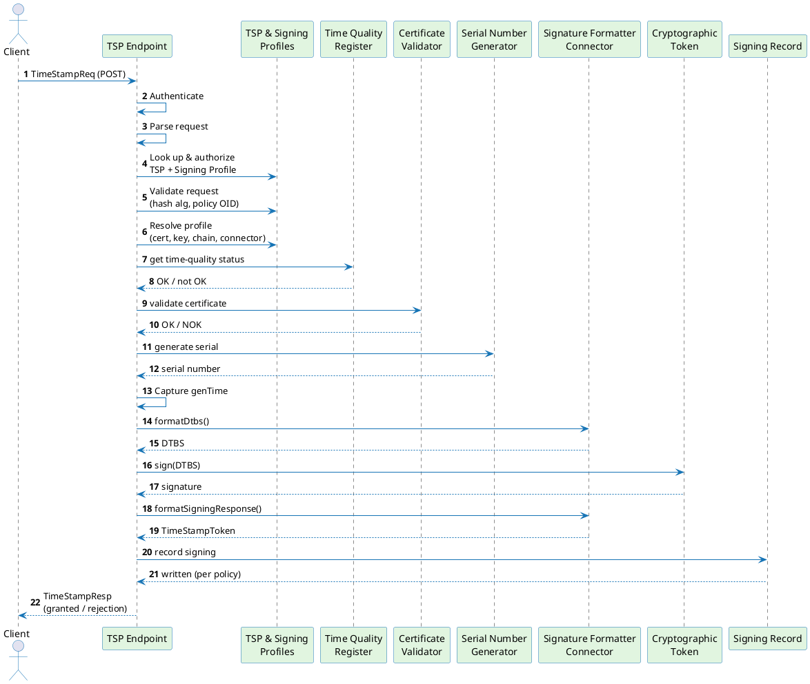

# Timestamping request flow

A timestamp request is a short conversation: a client asks ILM to certify "this hash existed at this time," and ILM either hands back a signed proof or explains why it can't. This page walks through that conversation stage by stage, so you can see what ILM checks, what it produces, and where a request can be rejected. It covers the **Timestamping × Managed (static key)** combination — currently the only one available (see [Timestamping overview](./overview.md)).

---

## Sequence diagram

The diagram shows every stage a request passes through, from the moment it reaches the TSP endpoint to the moment the response goes back to the caller. Authentication happens first, before any of the timestamping logic runs.

---

## Stage-by-stage walkthrough

### 1. Authentication

Before ILM looks at what's being asked, it checks who's asking:

- ILM identifies the `TSP Profile` from the request's URL. If the URL doesn't match any profile, the request is rejected immediately — no credentials are even examined.
- ILM then tries the caller's credentials in a fixed order: client certificate (mTLS) first, then bearer token, then username/password. Whichever method the request actually presents is the one that's checked — ILM doesn't try the others as a fallback. If that method isn't one of the profile's `allowedAuthenticationMethods`, the request is rejected.
- On rejection, the response tells the caller which authentication methods the profile does accept.

Repeated password logins are checked against a short-lived cache, so ILM doesn't recompute the credential check on every single call. Credential types, the cache, and how secrets are mapped to callers are covered in [Authentication and authorization](./authentication-authorization.md).

### 2. Request parsing and profile lookup

ILM decodes the request into its individual fields — the hash algorithm, the hash itself, an optional nonce, an optional policy identifier, whether the caller wants the signing certificate included, and any extra request extensions. It then:

1. Looks up the `TSP Profile` by name.
2. Checks that the caller is allowed to request timestamps from this profile. If they aren't, ILM returns the exact same rejection it would return for a profile that doesn't exist at all — this is deliberate, so a caller can't use error messages to discover which profiles exist.
3. Loads the linked `Signing Profile` and confirms it's enabled and configured for timestamping.

### 3. Request validation

ILM checks the request against rules set on the `Signing Profile`:

- **Hash algorithm** — if the profile restricts which hash algorithms it accepts, the request's algorithm must be on that list, or it's rejected. This is how you enforce an approved set of cryptographic algorithms across your deployment.
- **Policy identifier** — if the profile restricts allowed policy identifiers and the request specifies one, it must be on that list, or it's rejected.

### 4. Profile resolution

ILM loads everything the profile points to — the signing certificate and its chain, the key, and the connector that will format the token. None of this is cached; it's fetched fresh on every request. If no time quality configuration is set on the profile, ILM falls back to using its own system clock, which is always treated as accurate.

### 5. Time quality check

Timestamps are only meaningful if the clock that produced them can be trusted, so this is the first substantive check ILM performs. It asks: is the clock backing this profile currently accurate?

- If the profile has no time quality configuration, the answer is always yes (ILM's own clock is used, unverified).
- If it does have one, the answer is yes only when all of the following hold: a recent measurement exists, that measurement isn't stale, the measurement itself reports the clock as accurate, and neither a leap-second nor a drift guard has been tripped.

If the answer is anything but yes, ILM rejects the request outright — no token is produced. The component that continuously measures clock accuracy is described in [Time quality monitor](./time-quality-monitor.md).

### 6. Signing certificate validation

ILM confirms the certificate it's about to sign with is actually allowed to issue timestamps:

- The certificate must be explicitly marked for time-stamping use (a specific certificate extension that certificate authorities set when issuing a timestamping certificate).
- Its usage restrictions and validity period must also check out.

If either check fails, the request is rejected.

### 7. Serial number generation

Every token gets a serial number that's guaranteed unique — this is required by the timestamping standard and by EU trust-service rules. The generator can issue up to 25,600 serial numbers per second on a single instance without any coordination overhead, and it protects itself against two failure modes: running out of numbers in a single clock tick, and the system clock jumping backwards. If the clock regresses by more than 100 milliseconds, the request is rejected rather than risk issuing an inconsistent timestamp. Operational limits of this scheme are detailed on the [Limitations](./limitations.md) page.

Immediately after the serial number is issued, ILM captures the timestamp value itself (`genTime`), so both are sampled from the same instant.

### 8. Building the data to be signed

Assembling the final token takes two round-trips to the Timestamping Format Provider — a pluggable component that knows how to build the token's internal structure. In this first round-trip, ILM sends the connector everything it has gathered so far: the hash, nonce, policy identifier, extensions, serial number, timestamp, accuracy, certificate chain, and signature algorithm. The connector assembles the exact byte sequence that needs to be signed — including the piece that cryptographically ties the token to the specific signing certificate — and hands those bytes back. See [Timestamping Format Provider](/docs/certificate-key/connectors/provider-interfaces/timestamping-format-provider) for how this two-step exchange works.

### 9. Signing

ILM sends those bytes to the configured cryptographic token and asks it to sign them with the profile's managed key. The key itself never leaves the token — ILM only ever receives the resulting signature.

### 10. Assembling the final token

In the second round-trip to the formatter connector, ILM sends back the signed bytes together with the signature, and the connector assembles the complete, standards-compliant timestamp token. If the profile is configured to verify its own output, ILM checks the finished token's signature against the signing certificate before returning it — if that check fails, the request is rejected even though signing itself succeeded.

### 11. Signing record

Depending on the profile's configuration, ILM writes a record of what it just signed. This never blocks or fails the response to the caller — if writing the record fails, it's logged, but the caller still gets their token. Three write modes are available, trading off durability against latency:

- **Immediate** — written synchronously, before the response goes out.
- **Deferred, durable** — staged first, then written asynchronously; nothing is lost if ILM restarts.
- **Best effort** — queued in memory; can be dropped if the queue is overwhelmed.

See [Signing records](./signing-records.md) for the record's contents, how to retrieve them, and how long they're kept.

### 12. Response

ILM packages the result — either the granted token or a rejection — into the response format the timestamping standard expects, and returns it. Note that this response always comes back as a successful HTTP call; whether the timestamp was actually granted or rejected is indicated inside the response body, not by the HTTP status.

As in step 2, an authorization failure and a "profile doesn't exist" failure look identical to the caller.

---

## Error outcomes

| Stage | What went wrong | What the caller sees |
|---|---|---|
| Authentication | Method not allowed, or bad credentials | HTTP 401, before any timestamp-specific response is built |
| Authorization | Caller not permitted to use this profile | Generic rejection (indistinguishable from "profile not found") |
| Profile lookup | TSP or Signing Profile missing or disabled | Generic rejection |
| Request validation | Hash algorithm not allowed | Rejection: bad algorithm |
| Request validation | Policy identifier not allowed | Rejection: unaccepted policy |
| Profile resolution | Certificate, key, or connector can't be loaded | Rejection: system failure |
| Time quality | Clock accuracy not confirmed | Rejection: time not available |
| Certificate validation | Certificate not eligible for time-stamping | Rejection: system failure |
| Serial number | Clock jumped backwards more than 100 ms | Rejection: time not available |
| Serial number | Ran out of numbers within one clock tick | Rejection: system failure |
| Formatter connector | Communication error, either round-trip | Rejection: system failure |
| Token signature verification | Verification failed | Rejection: system failure |
| Signing record | Write failed | Not surfaced — the token was already granted |

A time quality rejection isn't limited to "the monitor reported a problem" — a stale measurement, excessive clock drift, or a leap-second conflict each count as not-OK on their own. See [Time quality configuration](./time-quality-configuration.md) for the complete list of causes.

---

## Related pages

- [Signing profile](/docs/signing/signing-profile) — workflow and scheme configuration
- [TSP profile](./tsp-profile.md) — authentication methods, linked signing profile
- [Time quality configuration](./time-quality-configuration.md) — reference clock, accuracy, leap-second guard
- [Timestamping overview](./overview.md) — workflow taxonomy and component architecture

Pages that expand on topics touched here:

- [Authentication & authorization](./authentication-authorization.md) — credential types, cache, secret mapping
- [Signing records](./signing-records.md) — schema, retrieval, retention
- [Time quality monitor](./time-quality-monitor.md) — how clock accuracy is measured and reported
- [Timestamping Format Provider](/docs/certificate-key/connectors/provider-interfaces/timestamping-format-provider) — connector operation and the two-round-trip calling convention
- [Limitations](./limitations.md) — serial number throughput and overflow
