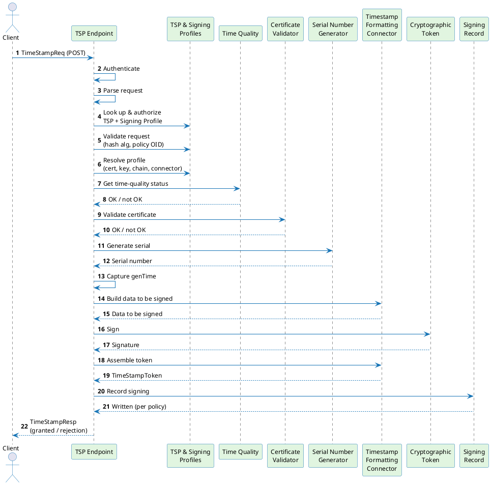

# Timestamping request flow

A timestamp request is a short conversation: a client asks the platform to certify "this hash existed at this time," and the platform either hands back a signed proof or explains why it can't. This page walks through that conversation stage by stage, so you can see what the platform checks, what it produces, and where a request can be rejected. It covers the **Timestamping** workflow with the **Managed · Static Key** scheme — currently the only combination available (see [Timestamping overview](./overview.md)).

---

## Sequence diagram

The diagram shows every stage a request passes through, from the moment it reaches the TSP endpoint to the moment the response goes back to the caller. Authentication happens first, before any of the timestamping logic runs.

---

## Stage-by-stage walkthrough

### Authentication (step 2)

Before the platform looks at what's being asked, it checks who's asking:

- The platform identifies the `TSP Profile` from the request's URL. If the URL doesn't match any profile, the request is rejected immediately — no credentials are even examined.
- The platform then tries the caller's credentials in a fixed order: client certificate (mTLS) first, then bearer token, then username/password. Whichever method the request actually presents is the one that's checked — the platform doesn't try the others as a fallback. If that method isn't one of the profile's `allowedAuthenticationMethods`, the request is rejected.
- On rejection, the response advertises the password and bearer-token methods the profile accepts in its `WWW-Authenticate` header; for a profile that only accepts client certificates there is no HTTP challenge to offer, so the header is omitted.

Repeated password logins are checked against a short-lived cache, so the platform doesn't recompute the credential check on every single call. Credential types, the cache, and how secrets are mapped to callers are covered in [Authentication and authorization](./authentication-authorization.md).

### Request parsing and profile lookup (steps 3–4)

The platform decodes the request into its individual fields — the hash algorithm, the hash itself, an optional nonce, an optional policy identifier, whether the caller wants the signing certificate included, and any extra request extensions. It then:

1. Looks up the `TSP Profile` by name.
2. Checks that the caller is allowed to request timestamps from this profile. If they aren't, the platform returns the exact same rejection it would return for a profile that doesn't exist at all — this is deliberate, so a caller can't use error messages to discover which profiles exist.
3. Loads the linked `Signing Profile` and confirms it's enabled and configured for timestamping.

### Request validation (step 5)

The platform checks the request against rules set on the `Signing Profile`:

- **Hash algorithm** — if the profile restricts which hash algorithms it accepts, the request's algorithm must be on that list, or it's rejected. This is how you enforce an approved set of cryptographic algorithms across your deployment.
- **Policy identifier** — if the profile restricts allowed policy identifiers and the request specifies one, it must be on that list, or it's rejected.

### Profile resolution (step 6)

The platform loads everything the profile points to — the signing certificate and its chain, the key, and the connector that will format the token. These lookups are served through short-lived, per-instance caches rather than hitting the database on every request — see [Caching](../../certificate-key/concept-design/architecture/caching.md). If no time quality configuration is set on the profile, the platform falls back to using its own system clock, which is always treated as accurate.

### Time quality check (steps 7–8)

Timestamps are only meaningful if the clock that produced them can be trusted, so this is the first substantive check the platform performs. The clock backing the profile must be currently confirmed accurate, or the request is rejected outright — no token is produced. (If the profile has no time quality configuration, the platform's own clock is used, unverified, and this check always passes.)

What counts as "confirmed accurate" — recency, drift, and leap-second conditions — is covered in [Time Quality Configuration](./time-quality-configuration.md); how it's measured is covered in [Time Quality Monitor](./time-quality-monitor.md).

### Signing certificate validation (steps 9–10)

The platform confirms the certificate it's about to sign with is actually allowed to issue timestamps:

- The certificate must be explicitly marked for time-stamping use (a specific certificate extension that certificate authorities set when issuing a timestamping certificate).
- Its usage restrictions and validity period must also check out.

If either check fails, the request is rejected.

### Serial number generation (steps 11–13)

Every token gets a serial number that's guaranteed unique — this is required by the timestamping standard and by EU trust-service rules. If the system clock jumps backwards far enough to risk an inconsistent timestamp, the request is rejected rather than issued. Throughput limits and the details of the generation scheme are covered on the [Limitations](./limitations.md) and [Serial number generator](./serial-number-generator.md) pages.

Immediately after the serial number is issued, the platform captures the timestamp value itself (`genTime`), so both are sampled from the same instant.

### Signing (steps 14–19)

Building the token takes three steps. The platform first asks the `Timestamp Formatting Connector` — the component that knows how to build the token's internal structure — to assemble the exact bytes to be signed. It sends those bytes to the configured cryptographic token to be signed with the profile's managed key (the key never leaves the token — the platform only receives the signature back). It then asks the connector to assemble the finished, standards-compliant timestamp token. If the profile is configured to verify its own output, the platform checks the finished token's signature before returning it; if that check fails, the request is rejected even though signing succeeded. See [Timestamp Formatting Connector](./timestamp-formatting-connector.md) for its user-configurable token content.

### Signing record (steps 20–21)

Depending on the profile's configuration, the platform writes a record of what it just signed. This never blocks or fails the response to the caller — if writing the record fails, it's logged, but the caller still gets their token. The available write modes trade durability against latency; see [Signing records](../signing-records.md) for the modes, the record's contents, and how long records are kept.

### Response (step 22)

The platform packages the result — either the granted token or a rejection — into the response format the timestamping standard expects, and returns it. Note that this response always comes back as a successful HTTP call; whether the timestamp was actually granted or rejected is indicated inside the response body, not by the HTTP status.

As during profile lookup, an authorization failure and a "profile doesn't exist" failure look identical to the caller.

---

## Error outcomes

| Stage | What went wrong | What the caller sees |
|---|---|---|
| Authentication | Method not allowed, or bad credentials | HTTP 401, before any timestamp-specific response is built |
| Authorization | Caller not permitted to use this profile | Generic rejection (indistinguishable from "profile not found") |
| Profile lookup | TSP or Signing Profile missing or disabled | Generic rejection |
| Request validation | Hash algorithm not allowed | Rejection: bad algorithm |
| Request validation | Policy identifier not allowed | Rejection: unaccepted policy |
| Profile resolution | Certificate, key, or connector can't be loaded | Rejection: system failure |
| Time quality | Clock accuracy not confirmed | Rejection: time not available |
| Certificate validation | Certificate not eligible for time-stamping | Rejection: system failure |
| Serial number | Clock jumped backwards more than 100 ms | Rejection: time not available |
| Timestamp Formatting Connector | Communication error, either round-trip | Rejection: system failure |
| Token signature verification | Verification failed | Rejection: system failure |
| Signing record | Write failed | Not surfaced — the token was already granted |

A time quality rejection isn't limited to "the monitor reported a problem" — a stale measurement, excessive clock drift, or a leap-second conflict each count as not-OK on their own. See [Time Quality Configuration](./time-quality-configuration.md) for the complete list of causes.

---

## Related pages

- [Signing Profile](/docs/signing/signing-profile) — workflow and scheme configuration
- [TSP Profile](./tsp-profile.md) — authentication methods, linked signing profile
- [Time Quality Configuration](./time-quality-configuration.md) — reference clock, accuracy, leap-second guard
- [Timestamping overview](./overview.md) — workflow taxonomy and component architecture

Pages that expand on topics touched here:

- [Authentication and authorization](./authentication-authorization.md) — credential types, cache, secret mapping
- [Signing records](../signing-records.md) — schema and retention
- [Time Quality Monitor](./time-quality-monitor.md) — how clock accuracy is measured and reported
- [Timestamp Formatting Connector](./timestamp-formatting-connector.md) — connector selection and configurable timestamp token content
- [Limitations](./limitations.md) — serial number throughput and overflow
